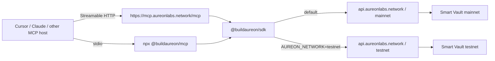
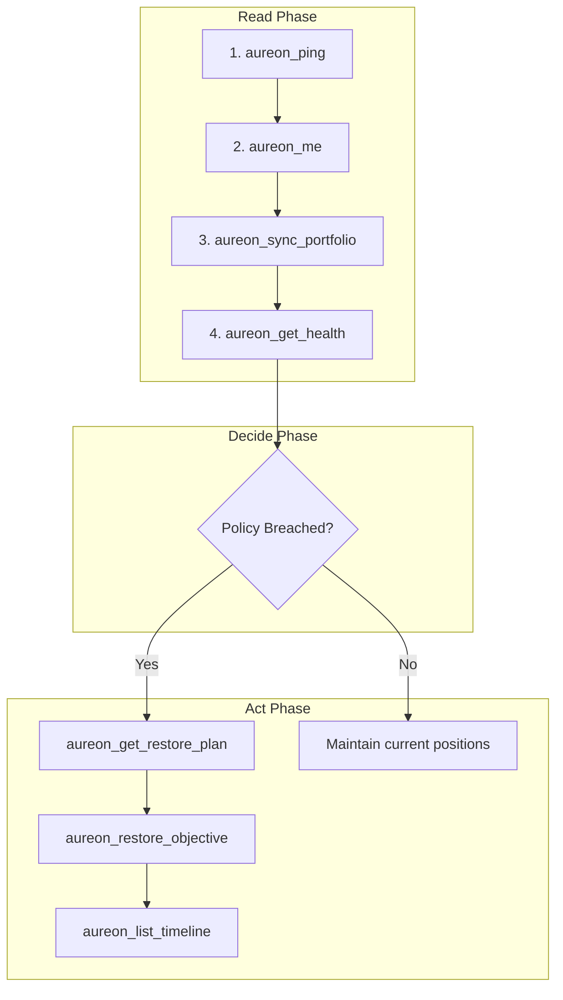

<div align="center">

# Aureon MCP

**The Financial Intelligence Layer for Onchain AI Agents**

Official [Model Context Protocol](https://modelcontextprotocol.io) server for the AUREON Financial Compass.  
Exposes the full `@buildaureon/sdk` surface as tools for Cursor, Claude Desktop, and any MCP host on the Robinhood Chain.

<br />

[](https://www.typescriptlang.org/)
[](https://modelcontextprotocol.io)
[](https://mcp.aureonlabs.network/mcp)
[](https://github.com/buildaureon)
[](LICENSE)
[](#requirements--installation)

<br />

```bash
# Hosted (no local process)
https://mcp.aureonlabs.network/mcp

# Or local stdio
npx -y @buildaureon/mcp
```

[How to connect](#how-to-connect) · [Quickstart](#quickstart) · [Architecture](#architecture) · [Authentication](#authentication) · [Tool Surface](#tool-surface) · [Agent Workflows](#agent-workflows) · [Docs](#documentation-registry)

</div>

---

## Table of Contents

1. [What is AUREON MCP?](#what-is-aureon-mcp)
2. [How to connect](#how-to-connect)
3. [Why AUREON MCP?](#why-aureon-mcp)
4. [Requirements & Installation](#requirements--installation)
5. [Architecture](#architecture)
6. [Quickstart](#quickstart)
7. [Authentication](#authentication)
8. [Tool Surface](#tool-surface)
9. [Agent Workflows](#agent-workflows)
10. [Sample Agent Prompts](#sample-agent-prompts)
11. [Security Model](#security-model)
12. [Development](#development)
13. [Documentation Registry](#documentation-registry)
14. [FAQ](#faq)
15. [Community & License](#community)

---

## What is AUREON MCP?

**AUREON** is a policy and execution layer for capital on **Robinhood Chain**. Agents register continuous financial rules (Financial Compass Objectives), monitor health, and restore allocations with honest settlement receipts rather than one-off swaps that forget intent.

**`@buildaureon/mcp`** is the agent adapter. It maps every public `@buildaureon/sdk` client method to a named tool (`aureon_ping`, `aureon_create_objective`, `aureon_restore_objective`, …). You can reach that same 54-tool surface in two ways:

| Transport | When to use it | How |
| --- | --- | --- |
| **Hosted HTTP** | Fastest path. No Node process on your machine. | Point the host at `https://mcp.aureonlabs.network/mcp` |
| **Local stdio** | You want your own issued API key in the host env. | `npx -y @buildaureon/mcp` |

The npm package is the stdio server. The official hosted process is Streamable HTTP at `/mcp` (see `hostedMCP/` in this monorepo). Both call `https://api.aureonlabs.network`. Neither holds a wallet private key. Neither signs or broadcasts.

| You can | Through |
| --- | --- |
| Authenticate with an issued developer API key | `AUREON_API_KEY` env (recommended) |
| Optionally complete a wallet Bearer handshake | `aureon_get_auth_nonce` → sign → `aureon_verify_wallet` |
| Sync and manage the Capital Book | `aureon_sync_portfolio`, `aureon_set_portfolio`, `aureon_clear_portfolio` |
| Create and query Financial Compass objectives | `aureon_create_objective`, `aureon_list_objectives`, … |
| Read health, timeline, vault, executions | `aureon_get_health`, `aureon_list_timeline`, `aureon_get_vault`, … |
| Prepare non-custodial vault deposit / withdraw steps | `aureon_prepare_vault_deposit`, `aureon_prepare_vault_withdraw` |
| Fetch and execute restore plans | `aureon_get_restore_plan`, `aureon_restore_objective` |
| Rehearse market shocks | `aureon_apply_market_event`, `aureon_refresh_watchdog` |
| Manage developer API keys | `aureon_list_api_keys`, `aureon_create_api_key`, … |

**54 tools**: one per public `AureonClient` method. Full schemas: [docs/tools.md](docs/tools.md).

For scripts without MCP, use [`@buildaureon/sdk`](https://github.com/buildaureon/aureon-sdk). The operator app at [app.aureonlabs.network](https://app.aureonlabs.network) stays wallet-Bearer only. Public Living Capital is still the testnet console. SDK and MCP default to mainnet.

---

## How to connect

### Hosted (recommended first use)

Paste this into Cursor `.cursor/mcp.json`. A user key is not required to connect.

```json
{
  "mcpServers": {
    "aureon": {
      "url": "https://mcp.aureonlabs.network/mcp"
    }
  }
}
```

Open without a key: `aureon_ping`, `aureon_list_market_presets`, `aureon_validate_receipt`.

Wallet tools need **your** issued Developers key on the same URL:

```json
{
  "mcpServers": {
    "aureon": {
      "url": "https://mcp.aureonlabs.network/mcp",
      "headers": {
        "X-Aureon-Api-Key": "<issued-developer-api-key>"
      }
    }
  }
}
```

Templates: [`examples/cursor.hosted.mcp.json`](examples/cursor.hosted.mcp.json), [`examples/cursor.hosted.user.mcp.json`](examples/cursor.hosted.user.mcp.json).

Confirm the host is up: [https://mcp.aureonlabs.network/healthz](https://mcp.aureonlabs.network/healthz).

Restart Cursor. Ask: *“Ping AUREON with aureon_ping.”* For `aureon_me` and the rest of your book, add the header or use stdio.

### Local stdio (your key)

```json
{
  "mcpServers": {
    "aureon": {
      "command": "npx",
      "args": ["-y", "@buildaureon/mcp"],
      "env": {
        "AUREON_API_KEY": "<issued-developer-api-key>"
      }
    }
  }
}
```

Issue the key at [app.aureonlabs.network](https://app.aureonlabs.network) → **Developers**. Template: [`examples/cursor.mcp.json`](examples/cursor.mcp.json).

---

## Why AUREON MCP?

Traditional AI trading scripts execute isolated market orders without context, forgetting target allocations as soon as a prompt ends. **AUREON MCP** provides a persistent financial compass for your AI agents:

* **Continuous Rules vs. One-off Swaps**: Instead of telling an agent to "buy 0.5 WETH," you register a Financial Compass Objective like *"Maintain 20% WETH weight with 3% tolerance."* The watchdog automatically monitors drift and plans restores when needed.
* **Non-Custodial Architecture**: Your private keys stay safely in your local wallet host. The MCP server generates unsigned transaction payloads that you review and sign.
* **Two transports, one tool surface**: Hosted HTTP at `https://mcp.aureonlabs.network/mcp`, or local stdio via `npx -y @buildaureon/mcp`. Same 54 tools. No local database to run.
* **Honest Settlement Receipts**: Clearly distinguishes between on-chain smart vault settlements (`vault`) and ledger-local staged receipts (`staged`).

---

## Requirements & Installation

### Requirements

- **Node.js**: 20 or higher (ESM compatible)
- **Developer API Key**: Issued at [app.aureonlabs.network](https://app.aureonlabs.network) → **Developers**. Public Living Capital is still the testnet console. SDK and MCP default to mainnet.
- **Network Access**: Default official API `https://api.aureonlabs.network` on mainnet. Optional `AUREON_NETWORK=testnet` stays on testnet on the same host.

### Installation

```bash
# Using pnpm
pnpm add @buildaureon/mcp

# Using npm
npm install @buildaureon/mcp

# Or run instantly via npx without installing
npx -y @buildaureon/mcp
```

You do not need to clone the AUREON monorepo: only the package and an issued key for the network you will call.

---

## Architecture



### Surface & Ownership Breakdown

| Surface | Auth | Role |
| --- | --- | --- |
| Operator utility | Wallet sign-in (Bearer) | Human operators managing vaults and approving manual restores |
| `@buildaureon/sdk` | Issued API key (+ optional Bearer) | Automated scripts, bots, serverless routines, and products |
| `@buildaureon/mcp` (stdio) | Same as SDK via host `env` | Local agent adapter you spawn with your issued key |
| Hosted MCP | URL-only for open tools. Optional `X-Aureon-Api-Key` for your wallet. | Same 54 tools over `https://mcp.aureonlabs.network/mcp` |

### Layer Responsibilities

| Concern | Owner | Description |
| --- | --- | --- |
| HTTP, retries, types, validation, errors | `@buildaureon/sdk` | Core underlying SDK client managing network communications |
| Tool names, zod schemas, agent formatting | `@buildaureon/mcp` | MCP server mapping SDK methods to AI-friendly tools |
| stdio / Streamable HTTP / JSON-RPC | `@modelcontextprotocol/sdk` | Official MCP protocol. Stdio is the npm package. Streamable HTTP is the official hosted process. |

**Trust boundary**: The API monitors objectives and generates restore plans; private keys stay strictly on the host machine. MCP never signs chain transactions.

Deep dive: [docs/architecture.md](docs/architecture.md).

---

## Quickstart

**Fastest path:** skip the key for now and use the hosted URL in [How to connect](#how-to-connect). The steps below are for **local stdio** with your own issued key.

### 1. Create an issued API key

Issue the key on the **same** API this MCP process will call:

1. Open https://app.aureonlabs.network → **Developers**.
2. Create API Key → copy your key once.

That key identifies your wallet for control-plane tools. **No Bearer token required.** Issue the key on the official API this process will call.

### 2. Configure Cursor IDE (local stdio)

If you already added the hosted URL, you do not need this block. For your own key, copy [`examples/cursor.mcp.json`](examples/cursor.mcp.json) into `.cursor/mcp.json`:

```json
{
  "mcpServers": {
    "aureon": {
      "command": "npx",
      "args": ["-y", "@buildaureon/mcp"],
      "env": {
        "AUREON_API_KEY": "<issued-developer-api-key>"
      }
    }
  }
}
```

Restart Cursor. Open the AI chat panel and ask: *“Ping AUREON and show my wallet with aureon_me.”*

### 3. Configure Claude Desktop

Merge [`examples/claude-desktop.json`](examples/claude-desktop.json) into Claude Desktop's configuration file:

* **macOS**: `~/Library/Application Support/Claude/claude_desktop_config.json`
* **Windows**: `%APPDATA%\Claude\claude_desktop_config.json`

```json
{
  "mcpServers": {
    "aureon": {
      "command": "npx",
      "args": ["-y", "@buildaureon/mcp"],
      "env": {
        "AUREON_API_KEY": "<issued-developer-api-key>"
      }
    }
  }
}
```

Restart Claude Desktop and test the connection.

### 4. From a local clone (maintainers)

```bash
pnpm install
pnpm --filter @buildaureon/mcp build
pnpm --filter @buildaureon/mcp start
```

Point the host `command` / `args` at the built `dist/index.js`. See [docs/setup.md](docs/setup.md).

---

## Authentication

### Recommended: Issued API key

| Variable | Required | Role |
| --- | --- | --- |
| `AUREON_API_KEY` | Yes (recommended) | Issued developer key for product access **and** wallet identity |
| `AUREON_NETWORK` | No | Omit for official API / mainnet. Set `testnet` to stay on testnet. |
| `AUREON_API_URL` | No | Optional override of `https://api.aureonlabs.network`. |
| `AUREON_AUTH_TOKEN` | No | Optional wallet Bearer (**wins** if both key and Bearer are sent) |

**Private Key Boundary**: Private keys are only needed outside MCP when signing and broadcasting deposit or withdrawal transactions. Prepare tools return unsigned transaction steps; the MCP server never signs.

### Optional: Wallet Bearer session

Use `aureon_get_auth_nonce` → host wallet signs challenge → `aureon_verify_wallet`. Prefer issued keys for always-on agents.

### Preview / Dev Mode only

`aureon_dev_login` works only when the API backend has `AUREON_ALLOW_DEV_LOGIN=1` (it does not function on production).

Deep dive: [docs/auth.md](docs/auth.md).

---

## Tool Surface

AUREON MCP exposes **54 tools** covering 100% of the `AureonClient` SDK surface:

| Category | Count | Tools Included | Primary Purpose |
| --- | --- | --- | --- |
| **Health** | 1 | `aureon_ping` | Check API connectivity & backend watchdog state |
| **Auth** | 5 | `aureon_get_auth_nonce`, `aureon_verify_wallet`, `aureon_dev_login`, `aureon_logout`, `aureon_me` | Manage wallet sessions, challenges, and identity |
| **Read** | 12 | `aureon_get_overview`, `aureon_get_portfolio`, `aureon_list_objectives`, `aureon_get_objective`, `aureon_get_health`, `aureon_list_timeline`, `aureon_list_market_presets`, `aureon_get_restore_plan`, `aureon_list_executions`, `aureon_get_vault`, `aureon_get_vault_status`, `aureon_get_audit_trail` | Inspect portfolio allocations, health scores, timelines, vault state, and the joined audit trail |
| **Objectives** | 4 | `aureon_create_objective`, `aureon_update_objective`, `aureon_pause_objective`, `aureon_resume_objective` | Create, modify, pause, and resume Financial Compass Objectives |
| **Portfolio** | 3 | `aureon_set_portfolio`, `aureon_clear_portfolio`, `aureon_sync_portfolio` | Synchronize and manage live Capital Book asset marks |
| **Execution** | 2 | `aureon_run_execution`, `aureon_restore_objective` | Trigger policy rebalancing and execute objective restore plans |
| **Market** | 2 | `aureon_apply_market_event`, `aureon_refresh_watchdog` | Rehearse market shocks (e.g. price shifts) against active policy |
| **Vault** | 2 | `aureon_prepare_vault_deposit`, `aureon_prepare_vault_withdraw` | Generate unsigned steps for non-custodial smart vault deposits/withdrawals |
| **Developer** | 4 | `aureon_list_api_keys`, `aureon_create_api_key`, `aureon_revoke_api_key`, `aureon_toggle_api_key` | Create, pause, and revoke developer API access keys |

Full argument schemas: [docs/tools.md](docs/tools.md) · Playbooks: [docs/agent-guide.md](docs/agent-guide.md).

### Locked fields

- `targetSymbol` and `automationMode` are set at **create** time and cannot be modified via `aureon_update_objective`: recreate the objective instead.
- Default `automationMode` is `"auto"`. Use `"manual"` only when a human must Approve changes inside the utility web app.

---

## Agent Workflows

Agents perform best when following the **Read → Decide → Act** execution pattern:



### 1. Control-Plane Routine (API Key Only)

1. `aureon_ping` → `aureon_me` (Verify connection and wallet identity)
2. `aureon_sync_portfolio` → `aureon_get_vault_status` (Fetch marks and check vault readiness)
3. If the vault is empty: `aureon_restore_objective` returns **409**. Call `aureon_prepare_vault_deposit`, return unsigned steps, and wait for the user or host wallet to broadcast. Agents do not fund the vault.
4. `aureon_create_objective` (`auto`) (Register continuous financial objective)
5. `aureon_refresh_watchdog` / `aureon_get_health` (Check health score and drift)
6. On violation after the vault is funded → `aureon_get_restore_plan` → `aureon_restore_objective`
7. Confirm with `aureon_list_timeline` (Verify settlement receipts)

### 2. Vault Deposit Path (API Key + External Signer)

1. `aureon_prepare_vault_deposit` → returns unsigned steps
2. Host wallet signs and broadcasts transaction on Robinhood Chain
3. `aureon_sync_portfolio` / `aureon_get_vault` (Re-sync marks to reflect new deposit)

More playbooks: [docs/agent-guide.md](docs/agent-guide.md).

---

## Sample Agent Prompts

Copy and paste these example prompts into Cursor or Claude Desktop:

### Portfolio Audit
> *"Ping AUREON, verify my wallet address with aureon_me, sync my portfolio, and give me a summary of total AUM and active objective health."*

### Setting a Compass Objective
> *"Create an automatic Financial Compass Objective named 'Maintain 20% WETH' targeting symbol WETH with weight 0.20 and tolerance 0.03."*

### Monitoring & Drift Restoration
> *"Refresh the watchdog and inspect my AUREON health. If any objective is in breach, show me the restore plan and run aureon_restore_objective."*

### Deposit Preparation
> *"Prepare an unsigned vault deposit for 0.1 ETH. Return the exact step payload so I can review and sign it in my wallet."*

---

## Security Model

* **Official hosted vs your own process**: Use `https://mcp.aureonlabs.network/mcp` for the official Streamable HTTP host. Local stdio is a child process of Cursor or Claude — do not publish **your** stdio server as an open internet socket. Do not put a wallet private key in either transport.
* **API Key Protection**: Treat `AUREON_API_KEY` like a password. Pause, revoke, or rotate keys in the Developer dashboard if compromised.
* **Environment Hygiene**: Never commit keys to version control. Never put wallet private keys into MCP environment variables.
* **Prompt Safety**: Review agent prompts before enabling write tools in untrusted or multi-user chat channels.

Deep dive details: [docs/security.md](docs/security.md).

---

## Development

To build and test `@buildaureon/mcp` locally:

```bash
pnpm install
pnpm --filter @buildaureon/mcp build
pnpm --filter @buildaureon/mcp test
pnpm --filter @buildaureon/mcp typecheck
```

### Script Reference

| Script | Purpose | Description |
| --- | --- | --- |
| `build` | `tsup` → `dist/` | Bundles TypeScript source into distribution ESM output |
| `dev` | `tsx src/index.ts` | Runs server directly from source for local development |
| `start` | `node dist/index.js` | Runs compiled distribution binary |
| `test` | `tsx --test ...` | Runs unit, smoke, and integration test suites |
| `typecheck` | `tsc --noEmit` | Validates TypeScript types across source files |

---

## Documentation Registry

| Document | Description & Contents |
| --- | --- |
| **[Setup Guide](docs/setup.md)** | Hosted URL first, then Cursor / Claude stdio, npx, source build, troubleshooting |
| **[Authentication Guide](docs/auth.md)** | Issued API key vs. Wallet Bearer vs. private key boundaries |
| **[Tools Reference](docs/tools.md)** | Full 54-tool reference with arguments, schemas, and caveats |
| **[Agent Playbooks](docs/agent-guide.md)** | End-to-end agent decision playbooks, turn templates, and anti-patterns |
| **[Architecture Deep Dive](docs/architecture.md)** | Module boundaries, file maps, and end-to-end request data flows |
| **[Security Model](docs/security.md)** | Credential management, threat modeling, and operational safety |
| **[Changelog](CHANGELOG.md)** | Published versions, including 0.1.10 mainnet default and hosted URL docs |
| **[`examples/cursor.hosted.mcp.json`](examples/cursor.hosted.mcp.json)** | Cursor config for URL-only hosted MCP |
| **[`examples/cursor.hosted.user.mcp.json`](examples/cursor.hosted.user.mcp.json)** | Same URL plus `X-Aureon-Api-Key` for your wallet tools |
| **[`@buildaureon/sdk`](https://github.com/buildaureon/aureon-sdk)** | Core TypeScript SDK documentation, types, and error definitions |

---

## FAQ

**Do I need a private key in Cursor or Claude env?**  
No. You only need an issued `AUREON_API_KEY`. Private keys stay in your host wallet when signing prepare steps.

**Is there only stdio?**  
No. Official hosted MCP is `https://mcp.aureonlabs.network/mcp` (Streamable HTTP, 54 tools). Connect with the URL alone for ping. Add `X-Aureon-Api-Key` for your wallet tools. Local stdio is `npx -y @buildaureon/mcp` with your issued `AUREON_API_KEY`.

**Does MCP talk to a local backend server?**  
No. Both transports call the official API `https://api.aureonlabs.network` on mainnet by default. Set `AUREON_NETWORK=testnet` on a **stdio** process to stay on testnet on that same host.

**Why did my restore receipt say `staged`?**  
`staged` is a ledger-local receipt, not an on-chain vault settlement. Always describe settlement receipts accurately in agent responses.

**Can agents use Manual automation mode?**  
Prefer Automatic (`auto`). Manual mode requires human Approval inside the operator utility app.

**What happens if an objective breaches its drift tolerance?**  
The watchdog marks health as breached. Agents call `aureon_get_restore_plan` to inspect the rebalancing steps, then `aureon_restore_objective` to execute the restore.

**How does MCP handle network errors or disconnects?**  
The underlying `@buildaureon/sdk` handles HTTP retries and reports structured error objects with stable error codes back to the MCP host.

---

## Community

- **Website**: https://www.aureonlabs.network
- **Hosted MCP**: https://mcp.aureonlabs.network/mcp
- **Hosted health**: https://mcp.aureonlabs.network/healthz
- **X (Twitter)**: https://x.com/buildaureon
- **App Utility**: https://app.aureonlabs.network
- **MCP repo**: https://github.com/buildaureon/aureon-mcp
- **SDK repo**: https://github.com/buildaureon/aureon-sdk

## License

MIT (see [LICENSE](LICENSE)).
