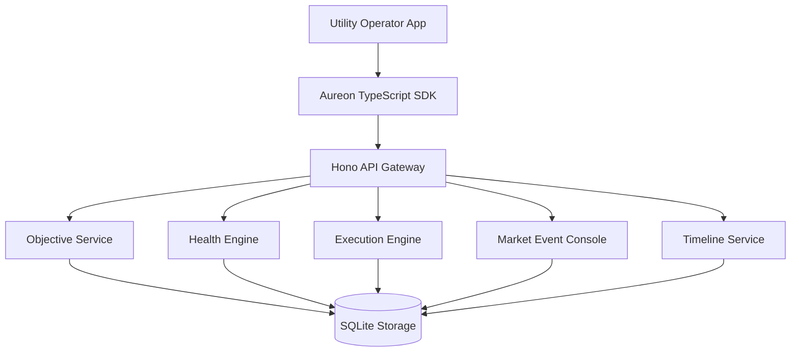
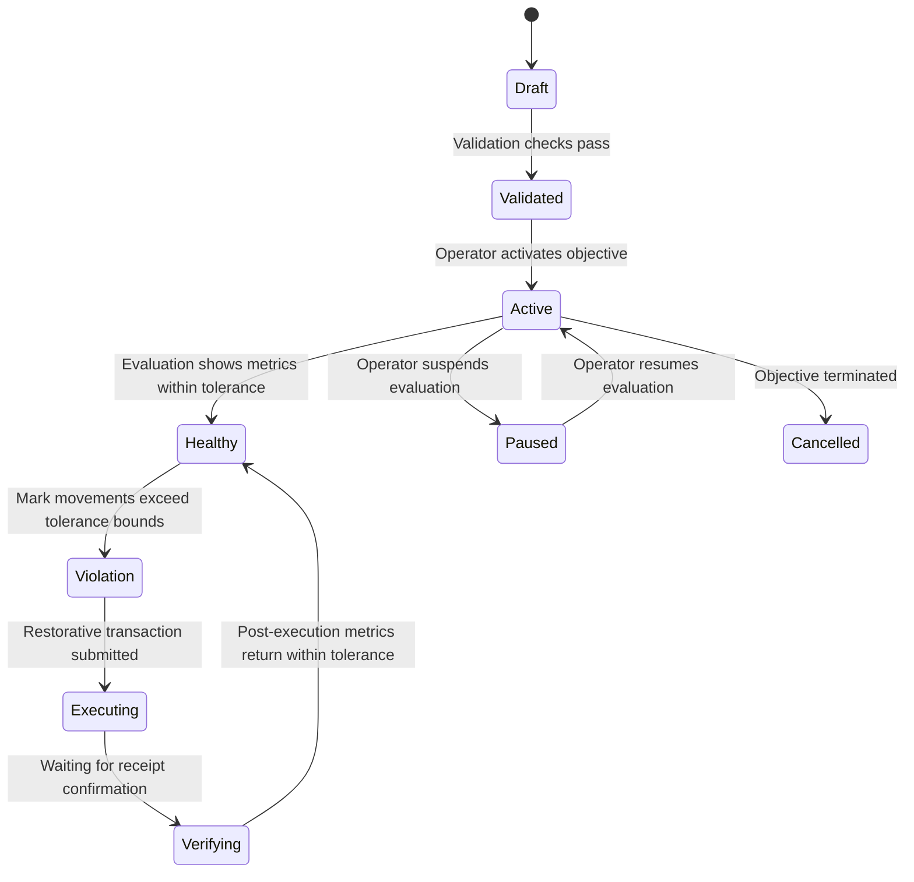
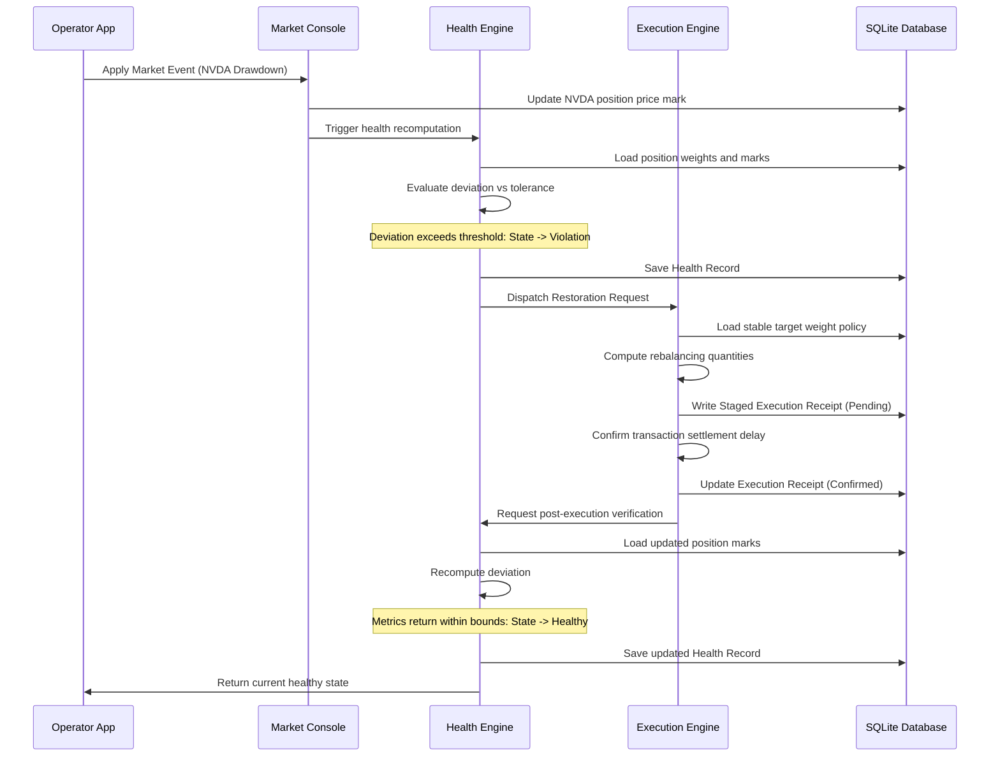

<div align="center">

# AUREON

### Intelligence That Compounds Capital.
#### The Operating System for Growing Capital.

**v0.1.0** · Protocol · SDK · Operator Utility

[](.github/workflows/ci.yml)
[](LICENSE)
[](sdk/README.md)
[](#)

Transform passive capital into continuously managed capital through programmable financial outcomes.

</div>

---

## 1. Introduction & Core Concept

AUREON is an objective-driven execution protocol designed specifically for digital assets and tokenized capital on the Robinhood Chain. Traditional financial applications depend on transaction-centric workflows where an operator explicitly submits single, isolated instructions (such as a swap, borrow, or transfer). Once that instruction settles, the application has no persistent memory of the overarching goal. 

AUREON introduces **Persistent Financial Objectives (PFOs)** as a first-class execution primitive. Instead of submitting isolated instructions, operators submit continuous financial intent. The AUREON engine evaluates objective health against the operator's portfolio state, determines if restoring action is required, coordinates execution, verifies results, and continues to monitor the objective indefinitely.

### 1.1 Persistent Intent vs. Transactional Action

| Operational Stage | Transactional Investing | AUREON Continuous Objectives |
|-------------------|-------------------------|------------------------------|
| **Setup** | Manual submission of swap order | Objective registered with weight & tolerance bounds |
| **Volatiliy** | Portfolio drifts; no automatic action | Health Engine flags deviation threshold breach |
| **Response** | Operator must manually trigger rebalance | Restorative execution triggered automatically |
| **Lifecycle** | Ends once transaction has settled | Persists indefinitely in monitoring loops |

---

## 2. Architecture & Request Flow

AUREON uses a modular, decoupled architecture consisting of an API gateway, domain services, a client SDK, and an operator dashboard interface. The preview runtime uses a local server and SQLite engine to manage state, enabling developers to exercise workflows before deploying smart contracts onto the Robinhood Chain.

### 2.1 System Context

The diagram below outlines how the developer utility and SDK clients interact with the primary services and the local SQLite database.



### 2.2 Objective Lifecycle State Machine

Objectives transition through various operational states based on policy definitions, portfolio marks, and execution results.



### 2.3 Restorative Execution Sequence

This diagram shows the execution flow when a controlled market event moves asset marks, causing an objective violation and subsequent automated restoration.



---

## 3. Monorepo Package Directory Map

This repository is organized as a pnpm monorepo. It contains the following packages and directories:

* **`backend/`**: A Hono-based API server written in TypeScript. It contains the Health Engine, Execution Engine, Timeline logger, and a SQLite database manager.
* **`utility/`**: A developer-focused operator dashboard built using React and TailwindCSS. It connects to the backend API to show real-time objectives, portfolio positions, and timelines.
* **`sdk/`**: `@aureon/sdk`, the official client SDK written in TypeScript.
* **`landing/`**: A static landing page placeholder.
* **`landing-site/`**: A high-end marketing website for AUREON built with React, GSAP, and TailwindCSS.
* **`contracts/`**: TypeScript interfaces and types outlining the on-chain Solidity `ObjectiveRegistry` contract specs.
* **`docs/`**: Detailed engineering guides detailing core modules, protocols, and guides.
* **`examples/`**: Code tutorials demonstrating end-to-end integration workflows.

---

## 4. Getting Started

### 4.1 Prerequisites

Ensure you have the following installed on your machine:
* Node.js (version 20 or higher)
* pnpm (version 9 or higher)

### 4.2 Workspace Installation

Install the monorepo dependencies from the root directory:

```bash
pnpm install
```

### 4.3 Building the SDK

The SDK must be compiled before running the utility dashboard or examples:

```bash
pnpm --filter @aureon/sdk build
```

### 4.4 Running the Services Locally

1. **Start the API Backend**:
   In your terminal, launch the Hono server:
   ```bash
   pnpm --filter @aureon/backend dev
   ```
   The backend API will run at `http://127.0.0.1:8787`.

2. **Start the Operator Utility Dashboard**:
   In another terminal, launch the Vite development server for the UI:
   ```bash
   pnpm --filter @aureon/utility dev
   ```
   The dashboard will run at `http://127.0.0.1:5173`.

3. **Start the Marketing Landing Site**:
   If you want to view the landing website, run:
   ```bash
   pnpm --filter @aureon/landing-site dev
   ```
   The marketing site will run at `http://127.0.0.1:5050`.

---

## 5. Detailed HTTP API Reference

The backend API uses JSON for all request payloads and responses. 

### 5.1 Authentication Endpoints

#### `GET /auth/nonce`
Requests a wallet sign-in challenge.
* **Query Parameters**:
  * `address` (string, required): The wallet address.
* **Response (200 OK)**:
  ```json
  {
    "walletAddress": "0x5FbDB2315678afecb367f032d93F642f64180aa3",
    "nonce": "challenge_nonce_string",
    "message": "Sign this message to login to AUREON...",
    "expiresAt": "2026-07-11T15:00:00.000Z"
  }
  ```

#### `POST /auth/verify`
Submits the wallet signature to establish an authenticated session.
* **Request Body**:
  * `address` (string): The wallet address.
  * `message` (string): The signed challenge message.
  * `signature` (string): The cryptographic signature.
* **Response (200 OK)**:
  ```json
  {
    "token": "bearer_jwt_token_string",
    "walletAddress": "0x5FbDB2315678afecb367f032d93F642f64180aa3",
    "expiresAt": "2026-07-11T16:00:00.000Z",
    "sessionId": "session_id_string"
  }
  ```

#### `POST /auth/dev-login`
Creates an unsigned developer bypass session. Available in local preview mode only.
* **Response (200 OK)**:
  ```json
  {
    "token": "bearer_jwt_token_string",
    "walletAddress": "0x0000000000000000000000000000000000000000",
    "expiresAt": "2026-07-12T12:00:00.000Z",
    "sessionId": "dev_session_id",
    "mode": "dev-bypass"
  }
  ```

---

### 5.2 Objectives Endpoints

#### `GET /objectives`
Lists all objectives registered to the authenticated wallet.
* **Headers**: `Authorization: Bearer <token>`
* **Response (200 OK)**:
  ```json
  {
    "objectives": [
      {
        "id": "obj_01h78dfa891bcde123456789",
        "name": "Maintain 20% Stable Assets",
        "kind": "stable_allocation",
        "status": "active",
        "priority": "high",
        "policy": {
          "targetWeight": 0.2,
          "tolerance": 0.02,
          "summary": "Maintain 20.0% stable allocation within ±2.0%"
        },
        "ownerId": "0x5FbDB2315678afecb367f032d93F642f64180aa3",
        "createdAt": "2026-07-11T10:00:00.000Z",
        "updatedAt": "2026-07-11T10:00:00.000Z",
        "lastEvaluatedAt": "2026-07-11T12:00:00.000Z",
        "lastExecutionId": "exec_01h78dfa891bcde999999999"
      }
    ]
  }
  ```

#### `POST /objectives`
Registers a new Persistent Financial Objective.
* **Headers**: `Authorization: Bearer <token>`
* **Request Body**:
  * `name` (string, required): A name for the objective (min 3 chars).
  * `kind` (string, required): One of `stable_allocation`, `balanced_portfolio`, `risk_ceiling`, `reward_reinvestment`.
  * `priority` (string, optional): One of `low`, `medium`, `high`, `critical`. Defaults to `high`.
  * `targetWeight` (number, required): Decimal weight between `0` and `1`.
  * `tolerance` (number, required): Tolerance band between `0` and `0.5`.
  * `maxRiskScore` (number, optional): Maximum risk ceiling (optional).
  * `reinvestRatio` (number, optional): Ratio for reward reinvesting (optional).
* **Response (201 Created)**: Returns the newly created objective object.

#### `PATCH /objectives/:id`
Updates parameters for an existing objective.
* **Headers**: `Authorization: Bearer <token>`
* **Request Body**: Accepts partial updates for `name`, `priority`, `targetWeight`, `tolerance`, `maxRiskScore`, or `reinvestRatio`.
* **Response (200 OK)**: Returns the updated objective object.

#### `POST /objectives/:id/pause`
Suspends continuous health evaluation for the objective.
* **Response (200 OK)**: Returns the objective with `status` set to `paused`.

#### `POST /objectives/:id/resume`
Resumes continuous health evaluation for a paused objective.
* **Response (200 OK)**: Returns the objective with `status` set to `active`.

---

### 5.3 Health, Timeline, & Executions

#### `GET /health`
Returns current health evaluation states.
* **Query Parameters**:
  * `objectiveId` (string, optional): Filter results to a single objective.
* **Response (200 OK)**:
  ```json
  {
    "health": [
      {
        "objectiveId": "obj_01h78dfa891bcde123456789",
        "state": "healthy",
        "score": 1,
        "currentMetric": 0.2015,
        "targetMetric": 0.2,
        "deviation": 0.0015,
        "message": "Allocation is within tolerance band",
        "evaluatedAt": "2026-07-11T12:00:00.000Z"
      }
    ]
  }
  ```

#### `GET /timeline`
Returns append-only timeline log events.
* **Query Parameters**:
  * `objectiveId` (string, optional): Filter to events for a specific objective.
* **Response (200 OK)**:
  ```json
  {
    "events": [
      {
        "id": "evt_01h78dfa891bcde555555555",
        "objectiveId": "obj_01h78dfa891bcde123456789",
        "type": "objective_created",
        "message": "Objective created and registered under owner account",
        "payload": {},
        "createdAt": "2026-07-11T10:00:00.000Z"
      }
    ]
  }
  ```

#### `GET /executions`
Lists execution logs containing staged transaction receipts.
* **Response (200 OK)**:
  ```json
  {
    "executions": [
      {
        "id": "exec_01h78dfa891bcde999999999",
        "objectiveId": "obj_01h78dfa891bcde123456789",
        "status": "confirmed",
        "transactionHash": "0x77d1ca8fb4...55a73e",
        "action": "rebalance",
        "notionalAdjustedUsd": 1250.75,
        "result": "Staged restoration rebalancing complete",
        "createdAt": "2026-07-11T11:00:00.000Z",
        "confirmedAt": "2026-07-11T11:00:00.350Z"
      }
    ]
  }
  ```

---

### 5.4 Portfolio & Market Rehearsal

#### `GET /portfolio`
Returns positions, asset category aggregates, and total notional valuation.
* **Response (200 OK)**:
  ```json
  {
    "portfolioId": "port_01h78dfa891bcde000000000",
    "totalNotionalUsd": 100000,
    "stableWeight": 0.2015,
    "stockTokenWeight": 0.7485,
    "gasWeight": 0.05,
    "positions": [
      {
        "id": "pos_usdg",
        "symbol": "USDG",
        "name": "Aureon Stable Token",
        "category": "stable",
        "quantity": 20150,
        "markPriceUsd": 1.0,
        "notionalUsd": 20150,
        "weight": 0.2015,
        "updatedAt": "2026-07-11T12:00:00.000Z"
      }
    ],
    "asOf": "2026-07-11T12:00:00.000Z"
  }
  ```

#### `POST /market/events`
Injects controlled mark movement changes into the local preview ledger.
* **Request Body**:
  * `symbol` (string): The ticker symbol to change (e.g. `NVDA`).
  * `priceChangeRatio` (number): The decimal percentage to shift the price (e.g. `-0.15` for a 15% drawdown).
  * `autoRestore` (boolean, optional): If `true`, the server automatically evaluates objective health and triggers execution. Defaults to `true`.
* **Response (200 OK)**: Returns the applied event data, updated portfolio snapshot, and health evaluation metrics.

---

## 6. Developer SDK Integration Guide

The `@aureon/sdk` package is the official library for interacting with the AUREON HTTP API. SDK clients send **both** a product API key (`X-Aureon-Api-Key`) and a wallet Bearer session. Vault deposit/withdraw uses `prepareVaultDeposit` / `prepareVaultWithdraw` — the host signs returned calldata steps; the API never holds user keys.

### 6.1 Client Configuration Options

When initializing the client, developers can pass an `AureonClientOptions` configuration object:

```ts
export interface AureonClientOptions {
  baseUrl: string;           // Base URL of the API gateway (e.g. https://api.aureonlabs.network)
  fetch?: typeof fetch;      // Custom fetch injection (useful for server runtimes)
  headers?: Record<string, string>; // Extra headers merged into all requests
  timeoutMs?: number;        // Request timeout in ms (defaults to 30000)
  authToken?: string | null; // Pre-obtained bearer token
  getAccessToken?: () => string | null | Promise<string | null>; // Dynamic token resolver
  logger?: AureonLogger;     // Logger interface for debug, warn, and error events
  maxRetries?: number;       // Max retry attempts for retryable errors (defaults to 2)
  retryDelayMs?: number;     // Initial delay in ms for backoff retries (defaults to 250)
}
```

### 6.2 Initializing the Client

Use `createAureonClient` to instantiate a client. In local development, you can use `createLocalAureonClient` to automatically connect to the default local address (`https://api.aureonlabs.network`).

```ts
import { createAureonClient, createLocalAureonClient } from "@aureon/sdk";

// Custom API Ingress configuration
const aureon = createAureonClient({
  baseUrl: "https://api.aureonlabs.network",
  timeoutMs: 15_000,
  maxRetries: 3,
});

// Default local connection helper
const localAureon = createLocalAureonClient();
```

### 6.3 Handling Authentication Challenges

Here is a step-by-step example showing how to request an auth challenge nonce, sign it, verify the signature, and configure the bearer token for subsequent calls:

```ts
import { createLocalAureonClient, createSessionTokenProvider } from "@aureon/sdk";

async function authenticateSession(walletAddress: string, signer: any) {
  // Create token provider to hold the bearer token
  const tokenProvider = createSessionTokenProvider();
  
  const client = createLocalAureonClient({
    getAccessToken: tokenProvider.getAccessToken,
  });

  // 1. Fetch challenge nonce from backend
  const { message } = await client.getAuthNonce(walletAddress);

  // 2. Sign message using the wallet signer
  const signature = await signer.signMessage(message);

  // 3. Verify signature and establish session
  const session = await client.verifyWallet({
    address: walletAddress,
    message,
    signature,
  });

  // 4. Update the token provider
  tokenProvider.setToken(session.token);

  console.log("Authentication successful! Session wallet:", session.walletAddress);
  return client;
}
```

---

## 7. Storage Design & SQLite Database

The local preview server uses Node's experimental native `node:sqlite` engine. Below is the structural schema of the database tables managed under `backend/src/db.ts`.

### 7.1 Database Entity Schema

```
  ┌────────────────────────────────────────────────────────┐
  │                      objectives                        │
  ├──────────────────┬──────────────────┬──────────────────┤
  │ id (TEXT PK)     │ name (TEXT)      │ kind (TEXT)      │
  │ status (TEXT)    │ priority (TEXT)  │ owner_id (TEXT)  │
  │ target_weight    │ tolerance        │ max_risk_score   │
  │ reinvest_ratio   │ target_symbol    │ automation_mode  │
  │ created_at       │ updated_at       │                  │
  └──────────────────┴──────────────────┴──────────────────┘
            │                  │                  │
            │ 1                │ 1                │ 1
            ▼ *                ▼ *                ▼ 1
  ┌──────────────────┐  ┌──────────────────┐  ┌──────────────────┐
  │    executions    │  │ timeline_events  │  │  health_records  │
  ├──────────────────┤  ├──────────────────┤  ├──────────────────┤
  │ id (TEXT PK)     │  │ id (TEXT PK)     │  │ objective_id (PK)│
  │ objective_id (FK)│  │ objective_id (FK)│  │ state (TEXT)     │
  │ status (TEXT)    │  │ type (TEXT)      │  │ score (REAL)     │
  │ tx_hash (TEXT)   │  │ message (TEXT)   │  │ current_metric   │
  │ adjusted_usd     │  │ payload_json     │  │ deviation (REAL) │
  │ confirmed_at     │  │ created_at       │  │ evaluated_at     │
  └──────────────────┘  └──────────────────┘  └──────────────────┘
```

### 7.2 Core Database Invariants

The backend database layer enforces rules during all insert and update statements:
1. **Target Weight Bound**: The `target_weight` field stored in the `objectives` table must satisfy `0 <= target_weight <= 1`.
2. **Tolerance Band Bound**: The `tolerance` field must satisfy `0 <= tolerance <= 0.5`.
3. **Owner Separation**: A wallet account is only permitted to query, update, or pause objectives that contain matching `owner_id` parameters.
4. **Idempotent Executions**: A unique transaction hash is generated for each execution receipt to prevent duplicate rebalancing actions.

---

## 8. Security & Preview Limits

Phase 1 provides an emulated environment for operators to rehearse. It does not interface with public networks or mainnet execution protocols. 

### 8.1 Trust Assumptions
* **Local Workstation Security**: The local backend API binds to `127.0.0.1` and does not use SSL configuration by default. Developers should not expose this local port to the internet.
* **Provisional Settlement Labels**: Staged transaction hashes returned in execution receipts do not represent actual transactions on the Robinhood Chain mainnet or testnet. They are local correlation keys.
* **Asset Allocation Limits**: Portfolio balances and asset price marks are stored in a local SQLite ledger. They do not correlate to actual tokens or assets held in external wallet software.

---

## 9. Troubleshooting & FAQ

### Q1: Why do my objective creations fail with a validation error?
Ensure that your `targetWeight` and `tolerance` inputs are formatted as decimal numbers (e.g. `0.20` for 20% weight and `0.02` for 2% tolerance). Common errors include submitting weights as integers (such as `20` instead of `0.20`).

### Q2: How does the backend calculate a violation?
The Health Engine checks the current weight of the target asset in your portfolio:
$$\text{Current Weight} = \frac{\text{Target Position Notional}}{\text{Total Portfolio Notional}}$$
If the absolute difference between the current weight and the target weight is greater than the tolerance value, the objective state transitions to `violation`.

### Q3: When does restorative execution start?
In the preview runtime, restorative execution starts immediately when a controlled market event is applied with the `autoRestore` parameter set to `true`. Alternatively, operators can trigger manual execution by calling the POST `/executions/run` endpoint directly.

---

## 10. License

This repository is distributed under the terms of the MIT License. Refer to the [LICENSE](LICENSE) file for the full text. Aureon is an independent project and is not affiliated with Robinhood Markets, Inc.
