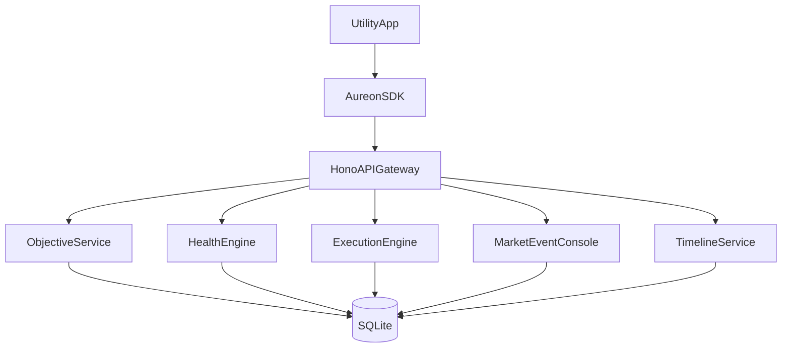
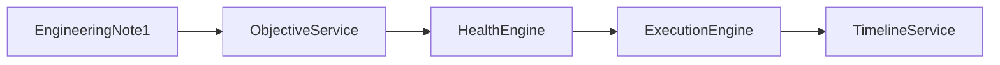
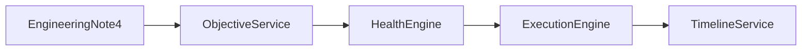
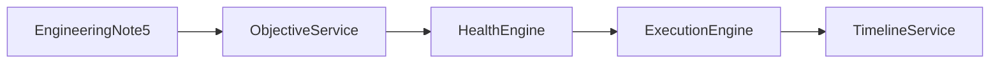
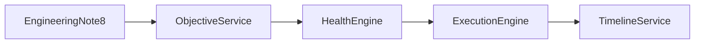

# AUREON System Architecture

Internal engineering documentation for the AUREON Persistent Financial Objectives protocol targeting Robinhood Chain. This document is written for protocol engineers, SDK integrators, and operator-utility maintainers who need a precise description of system behavior, invariants, and extension points.

## Purpose and scope

AUREON is organized as modular services around Persistent Financial Objectives. Each service owns a single responsibility and communicates through durable timeline events and shared SQLite state in the preview runtime. The architecture is intentionally replaceable so later phases can introduce Financial Intelligence, Programmable Capital, and a distributed Execution Network without breaking the Objective Service API.

## System context



## Component responsibilities

The API Gateway authenticates operator sessions in later phases and currently exposes open local endpoints for the preview runtime. The Objective Service owns CRUD and lifecycle transitions. The Policy constraints are embedded on the objective row as target weight and tolerance. The Health Engine computes metric deviation against portfolio weights. The Execution Engine performs restorative rebalancing and writes staged receipts. The Timeline Service appends immutable operator-visible events. The Market Event Console applies controlled mark moves used for launch demonstrations and regression scenarios.

## Trust boundaries

Preview runtime trust assumes a local operator workstation. Production deployments must introduce wallet authentication, signed objective ownership, and chain-verified execution receipts. Until those adapters land, staged transaction hashes remain provisional identifiers that still participate in timeline correlation and utility verification surfaces.

## Supplemental engineering note 1

This supplemental note elaborates operational nuance for aureon system architecture in production-shaped preview runtimes. Persistent Financial Objectives remain active after successful restorative execution, which means monitoring loops must treat confirmation as a transition back into continuous evaluation rather than a terminal state. Operators should correlate timeline events, health scores, and staged execution receipts when diagnosing unexpected deviations. Portfolio marks for Stock Tokens and USDG are treated as first-class inputs to policy evaluation, and any controlled market event must be durable in the market_events table before health recomputation begins. Downstream SDK clients should prefer typed error codes over string matching so utility surfaces can present distinct recovery paths for validation failures, conflicts, and transport timeouts. When extending the system, preserve modular service boundaries so Financial Intelligence and Execution Network phases can replace individual engines without rewriting the Objective Service contract.



Failure mode 1: if evaluation runs against a stale portfolio snapshot, health may report a false violation. The remediation is to always read portfolio_positions immediately before metric computation and to record evaluated_at on the objective row atomically with the health_records upsert. Idempotent execution identifiers prevent duplicate restorative actions when an operator retries from the utility after a transport interruption.

## Supplemental engineering note 2

This supplemental note elaborates operational nuance for aureon system architecture in production-shaped preview runtimes. Persistent Financial Objectives remain active after successful restorative execution, which means monitoring loops must treat confirmation as a transition back into continuous evaluation rather than a terminal state. Operators should correlate timeline events, health scores, and staged execution receipts when diagnosing unexpected deviations. Portfolio marks for Stock Tokens and USDG are treated as first-class inputs to policy evaluation, and any controlled market event must be durable in the market_events table before health recomputation begins. Downstream SDK clients should prefer typed error codes over string matching so utility surfaces can present distinct recovery paths for validation failures, conflicts, and transport timeouts. When extending the system, preserve modular service boundaries so Financial Intelligence and Execution Network phases can replace individual engines without rewriting the Objective Service contract.


Failure mode 2: if evaluation runs against a stale portfolio snapshot, health may report a false violation. The remediation is to always read portfolio_positions immediately before metric computation and to record evaluated_at on the objective row atomically with the health_records upsert. Idempotent execution identifiers prevent duplicate restorative actions when an operator retries from the utility after a transport interruption.

## Supplemental engineering note 3

This supplemental note elaborates operational nuance for aureon system architecture in production-shaped preview runtimes. Persistent Financial Objectives remain active after successful restorative execution, which means monitoring loops must treat confirmation as a transition back into continuous evaluation rather than a terminal state. Operators should correlate timeline events, health scores, and staged execution receipts when diagnosing unexpected deviations. Portfolio marks for Stock Tokens and USDG are treated as first-class inputs to policy evaluation, and any controlled market event must be durable in the market_events table before health recomputation begins. Downstream SDK clients should prefer typed error codes over string matching so utility surfaces can present distinct recovery paths for validation failures, conflicts, and transport timeouts. When extending the system, preserve modular service boundaries so Financial Intelligence and Execution Network phases can replace individual engines without rewriting the Objective Service contract.


Failure mode 3: if evaluation runs against a stale portfolio snapshot, health may report a false violation. The remediation is to always read portfolio_positions immediately before metric computation and to record evaluated_at on the objective row atomically with the health_records upsert. Idempotent execution identifiers prevent duplicate restorative actions when an operator retries from the utility after a transport interruption.

## Supplemental engineering note 4

This supplemental note elaborates operational nuance for aureon system architecture in production-shaped preview runtimes. Persistent Financial Objectives remain active after successful restorative execution, which means monitoring loops must treat confirmation as a transition back into continuous evaluation rather than a terminal state. Operators should correlate timeline events, health scores, and staged execution receipts when diagnosing unexpected deviations. Portfolio marks for Stock Tokens and USDG are treated as first-class inputs to policy evaluation, and any controlled market event must be durable in the market_events table before health recomputation begins. Downstream SDK clients should prefer typed error codes over string matching so utility surfaces can present distinct recovery paths for validation failures, conflicts, and transport timeouts. When extending the system, preserve modular service boundaries so Financial Intelligence and Execution Network phases can replace individual engines without rewriting the Objective Service contract.



Failure mode 4: if evaluation runs against a stale portfolio snapshot, health may report a false violation. The remediation is to always read portfolio_positions immediately before metric computation and to record evaluated_at on the objective row atomically with the health_records upsert. Idempotent execution identifiers prevent duplicate restorative actions when an operator retries from the utility after a transport interruption.

## Supplemental engineering note 5

This supplemental note elaborates operational nuance for aureon system architecture in production-shaped preview runtimes. Persistent Financial Objectives remain active after successful restorative execution, which means monitoring loops must treat confirmation as a transition back into continuous evaluation rather than a terminal state. Operators should correlate timeline events, health scores, and staged execution receipts when diagnosing unexpected deviations. Portfolio marks for Stock Tokens and USDG are treated as first-class inputs to policy evaluation, and any controlled market event must be durable in the market_events table before health recomputation begins. Downstream SDK clients should prefer typed error codes over string matching so utility surfaces can present distinct recovery paths for validation failures, conflicts, and transport timeouts. When extending the system, preserve modular service boundaries so Financial Intelligence and Execution Network phases can replace individual engines without rewriting the Objective Service contract.



Failure mode 5: if evaluation runs against a stale portfolio snapshot, health may report a false violation. The remediation is to always read portfolio_positions immediately before metric computation and to record evaluated_at on the objective row atomically with the health_records upsert. Idempotent execution identifiers prevent duplicate restorative actions when an operator retries from the utility after a transport interruption.

## Supplemental engineering note 6

This supplemental note elaborates operational nuance for aureon system architecture in production-shaped preview runtimes. Persistent Financial Objectives remain active after successful restorative execution, which means monitoring loops must treat confirmation as a transition back into continuous evaluation rather than a terminal state. Operators should correlate timeline events, health scores, and staged execution receipts when diagnosing unexpected deviations. Portfolio marks for Stock Tokens and USDG are treated as first-class inputs to policy evaluation, and any controlled market event must be durable in the market_events table before health recomputation begins. Downstream SDK clients should prefer typed error codes over string matching so utility surfaces can present distinct recovery paths for validation failures, conflicts, and transport timeouts. When extending the system, preserve modular service boundaries so Financial Intelligence and Execution Network phases can replace individual engines without rewriting the Objective Service contract.


Failure mode 6: if evaluation runs against a stale portfolio snapshot, health may report a false violation. The remediation is to always read portfolio_positions immediately before metric computation and to record evaluated_at on the objective row atomically with the health_records upsert. Idempotent execution identifiers prevent duplicate restorative actions when an operator retries from the utility after a transport interruption.

## Supplemental engineering note 7

This supplemental note elaborates operational nuance for aureon system architecture in production-shaped preview runtimes. Persistent Financial Objectives remain active after successful restorative execution, which means monitoring loops must treat confirmation as a transition back into continuous evaluation rather than a terminal state. Operators should correlate timeline events, health scores, and staged execution receipts when diagnosing unexpected deviations. Portfolio marks for Stock Tokens and USDG are treated as first-class inputs to policy evaluation, and any controlled market event must be durable in the market_events table before health recomputation begins. Downstream SDK clients should prefer typed error codes over string matching so utility surfaces can present distinct recovery paths for validation failures, conflicts, and transport timeouts. When extending the system, preserve modular service boundaries so Financial Intelligence and Execution Network phases can replace individual engines without rewriting the Objective Service contract.


Failure mode 7: if evaluation runs against a stale portfolio snapshot, health may report a false violation. The remediation is to always read portfolio_positions immediately before metric computation and to record evaluated_at on the objective row atomically with the health_records upsert. Idempotent execution identifiers prevent duplicate restorative actions when an operator retries from the utility after a transport interruption.

## Supplemental engineering note 8

This supplemental note elaborates operational nuance for aureon system architecture in production-shaped preview runtimes. Persistent Financial Objectives remain active after successful restorative execution, which means monitoring loops must treat confirmation as a transition back into continuous evaluation rather than a terminal state. Operators should correlate timeline events, health scores, and staged execution receipts when diagnosing unexpected deviations. Portfolio marks for Stock Tokens and USDG are treated as first-class inputs to policy evaluation, and any controlled market event must be durable in the market_events table before health recomputation begins. Downstream SDK clients should prefer typed error codes over string matching so utility surfaces can present distinct recovery paths for validation failures, conflicts, and transport timeouts. When extending the system, preserve modular service boundaries so Financial Intelligence and Execution Network phases can replace individual engines without rewriting the Objective Service contract.



Failure mode 8: if evaluation runs against a stale portfolio snapshot, health may report a false violation. The remediation is to always read portfolio_positions immediately before metric computation and to record evaluated_at on the objective row atomically with the health_records upsert. Idempotent execution identifiers prevent duplicate restorative actions when an operator retries from the utility after a transport interruption.

## Supplemental engineering note 9

This supplemental note elaborates operational nuance for aureon system architecture in production-shaped preview runtimes. Persistent Financial Objectives remain active after successful restorative execution, which means monitoring loops must treat confirmation as a transition back into continuous evaluation rather than a terminal state. Operators should correlate timeline events, health scores, and staged execution receipts when diagnosing unexpected deviations. Portfolio marks for Stock Tokens and USDG are treated as first-class inputs to policy evaluation, and any controlled market event must be durable in the market_events table before health recomputation begins. Downstream SDK clients should prefer typed error codes over string matching so utility surfaces can present distinct recovery paths for validation failures, conflicts, and transport timeouts. When extending the system, preserve modular service boundaries so Financial Intelligence and Execution Network phases can replace individual engines without rewriting the Objective Service contract.


Failure mode 9: if evaluation runs against a stale portfolio snapshot, health may report a false violation. The remediation is to always read portfolio_positions immediately before metric computation and to record evaluated_at on the objective row atomically with the health_records upsert. Idempotent execution identifiers prevent duplicate restorative actions when an operator retries from the utility after a transport interruption.

## Supplemental engineering note 10

This supplemental note elaborates operational nuance for aureon system architecture in production-shaped preview runtimes. Persistent Financial Objectives remain active after successful restorative execution, which means monitoring loops must treat confirmation as a transition back into continuous evaluation rather than a terminal state. Operators should correlate timeline events, health scores, and staged execution receipts when diagnosing unexpected deviations. Portfolio marks for Stock Tokens and USDG are treated as first-class inputs to policy evaluation, and any controlled market event must be durable in the market_events table before health recomputation begins. Downstream SDK clients should prefer typed error codes over string matching so utility surfaces can present distinct recovery paths for validation failures, conflicts, and transport timeouts. When extending the system, preserve modular service boundaries so Financial Intelligence and Execution Network phases can replace individual engines without rewriting the Objective Service contract.


Failure mode 10: if evaluation runs against a stale portfolio snapshot, health may report a false violation. The remediation is to always read portfolio_positions immediately before metric computation and to record evaluated_at on the objective row atomically with the health_records upsert. Idempotent execution identifiers prevent duplicate restorative actions when an operator retries from the utility after a transport interruption.

## Supplemental engineering note 11

This supplemental note elaborates operational nuance for aureon system architecture in production-shaped preview runtimes. Persistent Financial Objectives remain active after successful restorative execution, which means monitoring loops must treat confirmation as a transition back into continuous evaluation rather than a terminal state. Operators should correlate timeline events, health scores, and staged execution receipts when diagnosing unexpected deviations. Portfolio marks for Stock Tokens and USDG are treated as first-class inputs to policy evaluation, and any controlled market event must be durable in the market_events table before health recomputation begins. Downstream SDK clients should prefer typed error codes over string matching so utility surfaces can present distinct recovery paths for validation failures, conflicts, and transport timeouts. When extending the system, preserve modular service boundaries so Financial Intelligence and Execution Network phases can replace individual engines without rewriting the Objective Service contract.


Failure mode 11: if evaluation runs against a stale portfolio snapshot, health may report a false violation. The remediation is to always read portfolio_positions immediately before metric computation and to record evaluated_at on the objective row atomically with the health_records upsert. Idempotent execution identifiers prevent duplicate restorative actions when an operator retries from the utility after a transport interruption.

## Supplemental engineering note 12

This supplemental note elaborates operational nuance for aureon system architecture in production-shaped preview runtimes. Persistent Financial Objectives remain active after successful restorative execution, which means monitoring loops must treat confirmation as a transition back into continuous evaluation rather than a terminal state. Operators should correlate timeline events, health scores, and staged execution receipts when diagnosing unexpected deviations. Portfolio marks for Stock Tokens and USDG are treated as first-class inputs to policy evaluation, and any controlled market event must be durable in the market_events table before health recomputation begins. Downstream SDK clients should prefer typed error codes over string matching so utility surfaces can present distinct recovery paths for validation failures, conflicts, and transport timeouts. When extending the system, preserve modular service boundaries so Financial Intelligence and Execution Network phases can replace individual engines without rewriting the Objective Service contract.


Failure mode 12: if evaluation runs against a stale portfolio snapshot, health may report a false violation. The remediation is to always read portfolio_positions immediately before metric computation and to record evaluated_at on the objective row atomically with the health_records upsert. Idempotent execution identifiers prevent duplicate restorative actions when an operator retries from the utility after a transport interruption.

## Supplemental engineering note 13

This supplemental note elaborates operational nuance for aureon system architecture in production-shaped preview runtimes. Persistent Financial Objectives remain active after successful restorative execution, which means monitoring loops must treat confirmation as a transition back into continuous evaluation rather than a terminal state. Operators should correlate timeline events, health scores, and staged execution receipts when diagnosing unexpected deviations. Portfolio marks for Stock Tokens and USDG are treated as first-class inputs to policy evaluation, and any controlled market event must be durable in the market_events table before health recomputation begins. Downstream SDK clients should prefer typed error codes over string matching so utility surfaces can present distinct recovery paths for validation failures, conflicts, and transport timeouts. When extending the system, preserve modular service boundaries so Financial Intelligence and Execution Network phases can replace individual engines without rewriting the Objective Service contract.


Failure mode 13: if evaluation runs against a stale portfolio snapshot, health may report a false violation. The remediation is to always read portfolio_positions immediately before metric computation and to record evaluated_at on the objective row atomically with the health_records upsert. Idempotent execution identifiers prevent duplicate restorative actions when an operator retries from the utility after a transport interruption.

## Supplemental engineering note 14

This supplemental note elaborates operational nuance for aureon system architecture in production-shaped preview runtimes. Persistent Financial Objectives remain active after successful restorative execution, which means monitoring loops must treat confirmation as a transition back into continuous evaluation rather than a terminal state. Operators should correlate timeline events, health scores, and staged execution receipts when diagnosing unexpected deviations. Portfolio marks for Stock Tokens and USDG are treated as first-class inputs to policy evaluation, and any controlled market event must be durable in the market_events table before health recomputation begins. Downstream SDK clients should prefer typed error codes over string matching so utility surfaces can present distinct recovery paths for validation failures, conflicts, and transport timeouts. When extending the system, preserve modular service boundaries so Financial Intelligence and Execution Network phases can replace individual engines without rewriting the Objective Service contract.


Failure mode 14: if evaluation runs against a stale portfolio snapshot, health may report a false violation. The remediation is to always read portfolio_positions immediately before metric computation and to record evaluated_at on the objective row atomically with the health_records upsert. Idempotent execution identifiers prevent duplicate restorative actions when an operator retries from the utility after a transport interruption.

## Supplemental engineering note 15

This supplemental note elaborates operational nuance for aureon system architecture in production-shaped preview runtimes. Persistent Financial Objectives remain active after successful restorative execution, which means monitoring loops must treat confirmation as a transition back into continuous evaluation rather than a terminal state. Operators should correlate timeline events, health scores, and staged execution receipts when diagnosing unexpected deviations. Portfolio marks for Stock Tokens and USDG are treated as first-class inputs to policy evaluation, and any controlled market event must be durable in the market_events table before health recomputation begins. Downstream SDK clients should prefer typed error codes over string matching so utility surfaces can present distinct recovery paths for validation failures, conflicts, and transport timeouts. When extending the system, preserve modular service boundaries so Financial Intelligence and Execution Network phases can replace individual engines without rewriting the Objective Service contract.


Failure mode 15: if evaluation runs against a stale portfolio snapshot, health may report a false violation. The remediation is to always read portfolio_positions immediately before metric computation and to record evaluated_at on the objective row atomically with the health_records upsert. Idempotent execution identifiers prevent duplicate restorative actions when an operator retries from the utility after a transport interruption.

## Supplemental engineering note 16

This supplemental note elaborates operational nuance for aureon system architecture in production-shaped preview runtimes. Persistent Financial Objectives remain active after successful restorative execution, which means monitoring loops must treat confirmation as a transition back into continuous evaluation rather than a terminal state. Operators should correlate timeline events, health scores, and staged execution receipts when diagnosing unexpected deviations. Portfolio marks for Stock Tokens and USDG are treated as first-class inputs to policy evaluation, and any controlled market event must be durable in the market_events table before health recomputation begins. Downstream SDK clients should prefer typed error codes over string matching so utility surfaces can present distinct recovery paths for validation failures, conflicts, and transport timeouts. When extending the system, preserve modular service boundaries so Financial Intelligence and Execution Network phases can replace individual engines without rewriting the Objective Service contract.


Failure mode 16: if evaluation runs against a stale portfolio snapshot, health may report a false violation. The remediation is to always read portfolio_positions immediately before metric computation and to record evaluated_at on the objective row atomically with the health_records upsert. Idempotent execution identifiers prevent duplicate restorative actions when an operator retries from the utility after a transport interruption.

## Supplemental engineering note 17

This supplemental note elaborates operational nuance for aureon system architecture in production-shaped preview runtimes. Persistent Financial Objectives remain active after successful restorative execution, which means monitoring loops must treat confirmation as a transition back into continuous evaluation rather than a terminal state. Operators should correlate timeline events, health scores, and staged execution receipts when diagnosing unexpected deviations. Portfolio marks for Stock Tokens and USDG are treated as first-class inputs to policy evaluation, and any controlled market event must be durable in the market_events table before health recomputation begins. Downstream SDK clients should prefer typed error codes over string matching so utility surfaces can present distinct recovery paths for validation failures, conflicts, and transport timeouts. When extending the system, preserve modular service boundaries so Financial Intelligence and Execution Network phases can replace individual engines without rewriting the Objective Service contract.


Failure mode 17: if evaluation runs against a stale portfolio snapshot, health may report a false violation. The remediation is to always read portfolio_positions immediately before metric computation and to record evaluated_at on the objective row atomically with the health_records upsert. Idempotent execution identifiers prevent duplicate restorative actions when an operator retries from the utility after a transport interruption.

## Supplemental engineering note 18

This supplemental note elaborates operational nuance for aureon system architecture in production-shaped preview runtimes. Persistent Financial Objectives remain active after successful restorative execution, which means monitoring loops must treat confirmation as a transition back into continuous evaluation rather than a terminal state. Operators should correlate timeline events, health scores, and staged execution receipts when diagnosing unexpected deviations. Portfolio marks for Stock Tokens and USDG are treated as first-class inputs to policy evaluation, and any controlled market event must be durable in the market_events table before health recomputation begins. Downstream SDK clients should prefer typed error codes over string matching so utility surfaces can present distinct recovery paths for validation failures, conflicts, and transport timeouts. When extending the system, preserve modular service boundaries so Financial Intelligence and Execution Network phases can replace individual engines without rewriting the Objective Service contract.


Failure mode 18: if evaluation runs against a stale portfolio snapshot, health may report a false violation. The remediation is to always read portfolio_positions immediately before metric computation and to record evaluated_at on the objective row atomically with the health_records upsert. Idempotent execution identifiers prevent duplicate restorative actions when an operator retries from the utility after a transport interruption.

## Supplemental engineering note 19

This supplemental note elaborates operational nuance for aureon system architecture in production-shaped preview runtimes. Persistent Financial Objectives remain active after successful restorative execution, which means monitoring loops must treat confirmation as a transition back into continuous evaluation rather than a terminal state. Operators should correlate timeline events, health scores, and staged execution receipts when diagnosing unexpected deviations. Portfolio marks for Stock Tokens and USDG are treated as first-class inputs to policy evaluation, and any controlled market event must be durable in the market_events table before health recomputation begins. Downstream SDK clients should prefer typed error codes over string matching so utility surfaces can present distinct recovery paths for validation failures, conflicts, and transport timeouts. When extending the system, preserve modular service boundaries so Financial Intelligence and Execution Network phases can replace individual engines without rewriting the Objective Service contract.


Failure mode 19: if evaluation runs against a stale portfolio snapshot, health may report a false violation. The remediation is to always read portfolio_positions immediately before metric computation and to record evaluated_at on the objective row atomically with the health_records upsert. Idempotent execution identifiers prevent duplicate restorative actions when an operator retries from the utility after a transport interruption.

## Supplemental engineering note 20

This supplemental note elaborates operational nuance for aureon system architecture in production-shaped preview runtimes. Persistent Financial Objectives remain active after successful restorative execution, which means monitoring loops must treat confirmation as a transition back into continuous evaluation rather than a terminal state. Operators should correlate timeline events, health scores, and staged execution receipts when diagnosing unexpected deviations. Portfolio marks for Stock Tokens and USDG are treated as first-class inputs to policy evaluation, and any controlled market event must be durable in the market_events table before health recomputation begins. Downstream SDK clients should prefer typed error codes over string matching so utility surfaces can present distinct recovery paths for validation failures, conflicts, and transport timeouts. When extending the system, preserve modular service boundaries so Financial Intelligence and Execution Network phases can replace individual engines without rewriting the Objective Service contract.

```mermaid
flowchart LR
  Note20[EngineeringNote20] --> ObjectiveService
  ObjectiveService --> HealthEngine
  HealthEngine --> ExecutionEngine
  ExecutionEngine --> TimelineService
```

Failure mode 20: if evaluation runs against a stale portfolio snapshot, health may report a false violation. The remediation is to always read portfolio_positions immediately before metric computation and to record evaluated_at on the objective row atomically with the health_records upsert. Idempotent execution identifiers prevent duplicate restorative actions when an operator retries from the utility after a transport interruption.

## Supplemental engineering note 21

This supplemental note elaborates operational nuance for aureon system architecture in production-shaped preview runtimes. Persistent Financial Objectives remain active after successful restorative execution, which means monitoring loops must treat confirmation as a transition back into continuous evaluation rather than a terminal state. Operators should correlate timeline events, health scores, and staged execution receipts when diagnosing unexpected deviations. Portfolio marks for Stock Tokens and USDG are treated as first-class inputs to policy evaluation, and any controlled market event must be durable in the market_events table before health recomputation begins. Downstream SDK clients should prefer typed error codes over string matching so utility surfaces can present distinct recovery paths for validation failures, conflicts, and transport timeouts. When extending the system, preserve modular service boundaries so Financial Intelligence and Execution Network phases can replace individual engines without rewriting the Objective Service contract.

```mermaid
flowchart LR
  Note21[EngineeringNote21] --> ObjectiveService
  ObjectiveService --> HealthEngine
  HealthEngine --> ExecutionEngine
  ExecutionEngine --> TimelineService
```

Failure mode 21: if evaluation runs against a stale portfolio snapshot, health may report a false violation. The remediation is to always read portfolio_positions immediately before metric computation and to record evaluated_at on the objective row atomically with the health_records upsert. Idempotent execution identifiers prevent duplicate restorative actions when an operator retries from the utility after a transport interruption.

## Supplemental engineering note 22

This supplemental note elaborates operational nuance for aureon system architecture in production-shaped preview runtimes. Persistent Financial Objectives remain active after successful restorative execution, which means monitoring loops must treat confirmation as a transition back into continuous evaluation rather than a terminal state. Operators should correlate timeline events, health scores, and staged execution receipts when diagnosing unexpected deviations. Portfolio marks for Stock Tokens and USDG are treated as first-class inputs to policy evaluation, and any controlled market event must be durable in the market_events table before health recomputation begins. Downstream SDK clients should prefer typed error codes over string matching so utility surfaces can present distinct recovery paths for validation failures, conflicts, and transport timeouts. When extending the system, preserve modular service boundaries so Financial Intelligence and Execution Network phases can replace individual engines without rewriting the Objective Service contract.

```mermaid
flowchart LR
  Note22[EngineeringNote22] --> ObjectiveService
  ObjectiveService --> HealthEngine
  HealthEngine --> ExecutionEngine
  ExecutionEngine --> TimelineService
```

Failure mode 22: if evaluation runs against a stale portfolio snapshot, health may report a false violation. The remediation is to always read portfolio_positions immediately before metric computation and to record evaluated_at on the objective row atomically with the health_records upsert. Idempotent execution identifiers prevent duplicate restorative actions when an operator retries from the utility after a transport interruption.

## Supplemental engineering note 23

This supplemental note elaborates operational nuance for aureon system architecture in production-shaped preview runtimes. Persistent Financial Objectives remain active after successful restorative execution, which means monitoring loops must treat confirmation as a transition back into continuous evaluation rather than a terminal state. Operators should correlate timeline events, health scores, and staged execution receipts when diagnosing unexpected deviations. Portfolio marks for Stock Tokens and USDG are treated as first-class inputs to policy evaluation, and any controlled market event must be durable in the market_events table before health recomputation begins. Downstream SDK clients should prefer typed error codes over string matching so utility surfaces can present distinct recovery paths for validation failures, conflicts, and transport timeouts. When extending the system, preserve modular service boundaries so Financial Intelligence and Execution Network phases can replace individual engines without rewriting the Objective Service contract.

```mermaid
flowchart LR
  Note23[EngineeringNote23] --> ObjectiveService
  ObjectiveService --> HealthEngine
  HealthEngine --> ExecutionEngine
  ExecutionEngine --> TimelineService
```

Failure mode 23: if evaluation runs against a stale portfolio snapshot, health may report a false violation. The remediation is to always read portfolio_positions immediately before metric computation and to record evaluated_at on the objective row atomically with the health_records upsert. Idempotent execution identifiers prevent duplicate restorative actions when an operator retries from the utility after a transport interruption.

## Supplemental engineering note 24

This supplemental note elaborates operational nuance for aureon system architecture in production-shaped preview runtimes. Persistent Financial Objectives remain active after successful restorative execution, which means monitoring loops must treat confirmation as a transition back into continuous evaluation rather than a terminal state. Operators should correlate timeline events, health scores, and staged execution receipts when diagnosing unexpected deviations. Portfolio marks for Stock Tokens and USDG are treated as first-class inputs to policy evaluation, and any controlled market event must be durable in the market_events table before health recomputation begins. Downstream SDK clients should prefer typed error codes over string matching so utility surfaces can present distinct recovery paths for validation failures, conflicts, and transport timeouts. When extending the system, preserve modular service boundaries so Financial Intelligence and Execution Network phases can replace individual engines without rewriting the Objective Service contract.

```mermaid
flowchart LR
  Note24[EngineeringNote24] --> ObjectiveService
  ObjectiveService --> HealthEngine
  HealthEngine --> ExecutionEngine
  ExecutionEngine --> TimelineService
```

Failure mode 24: if evaluation runs against a stale portfolio snapshot, health may report a false violation. The remediation is to always read portfolio_positions immediately before metric computation and to record evaluated_at on the objective row atomically with the health_records upsert. Idempotent execution identifiers prevent duplicate restorative actions when an operator retries from the utility after a transport interruption.

## Supplemental engineering note 25

This supplemental note elaborates operational nuance for aureon system architecture in production-shaped preview runtimes. Persistent Financial Objectives remain active after successful restorative execution, which means monitoring loops must treat confirmation as a transition back into continuous evaluation rather than a terminal state. Operators should correlate timeline events, health scores, and staged execution receipts when diagnosing unexpected deviations. Portfolio marks for Stock Tokens and USDG are treated as first-class inputs to policy evaluation, and any controlled market event must be durable in the market_events table before health recomputation begins. Downstream SDK clients should prefer typed error codes over string matching so utility surfaces can present distinct recovery paths for validation failures, conflicts, and transport timeouts. When extending the system, preserve modular service boundaries so Financial Intelligence and Execution Network phases can replace individual engines without rewriting the Objective Service contract.

```mermaid
flowchart LR
  Note25[EngineeringNote25] --> ObjectiveService
  ObjectiveService --> HealthEngine
  HealthEngine --> ExecutionEngine
  ExecutionEngine --> TimelineService
```

Failure mode 25: if evaluation runs against a stale portfolio snapshot, health may report a false violation. The remediation is to always read portfolio_positions immediately before metric computation and to record evaluated_at on the objective row atomically with the health_records upsert. Idempotent execution identifiers prevent duplicate restorative actions when an operator retries from the utility after a transport interruption.

## Supplemental engineering note 26

This supplemental note elaborates operational nuance for aureon system architecture in production-shaped preview runtimes. Persistent Financial Objectives remain active after successful restorative execution, which means monitoring loops must treat confirmation as a transition back into continuous evaluation rather than a terminal state. Operators should correlate timeline events, health scores, and staged execution receipts when diagnosing unexpected deviations. Portfolio marks for Stock Tokens and USDG are treated as first-class inputs to policy evaluation, and any controlled market event must be durable in the market_events table before health recomputation begins. Downstream SDK clients should prefer typed error codes over string matching so utility surfaces can present distinct recovery paths for validation failures, conflicts, and transport timeouts. When extending the system, preserve modular service boundaries so Financial Intelligence and Execution Network phases can replace individual engines without rewriting the Objective Service contract.

```mermaid
flowchart LR
  Note26[EngineeringNote26] --> ObjectiveService
  ObjectiveService --> HealthEngine
  HealthEngine --> ExecutionEngine
  ExecutionEngine --> TimelineService
```

Failure mode 26: if evaluation runs against a stale portfolio snapshot, health may report a false violation. The remediation is to always read portfolio_positions immediately before metric computation and to record evaluated_at on the objective row atomically with the health_records upsert. Idempotent execution identifiers prevent duplicate restorative actions when an operator retries from the utility after a transport interruption.

## Supplemental engineering note 27

This supplemental note elaborates operational nuance for aureon system architecture in production-shaped preview runtimes. Persistent Financial Objectives remain active after successful restorative execution, which means monitoring loops must treat confirmation as a transition back into continuous evaluation rather than a terminal state. Operators should correlate timeline events, health scores, and staged execution receipts when diagnosing unexpected deviations. Portfolio marks for Stock Tokens and USDG are treated as first-class inputs to policy evaluation, and any controlled market event must be durable in the market_events table before health recomputation begins. Downstream SDK clients should prefer typed error codes over string matching so utility surfaces can present distinct recovery paths for validation failures, conflicts, and transport timeouts. When extending the system, preserve modular service boundaries so Financial Intelligence and Execution Network phases can replace individual engines without rewriting the Objective Service contract.

```mermaid
flowchart LR
  Note27[EngineeringNote27] --> ObjectiveService
  ObjectiveService --> HealthEngine
  HealthEngine --> ExecutionEngine
  ExecutionEngine --> TimelineService
```

Failure mode 27: if evaluation runs against a stale portfolio snapshot, health may report a false violation. The remediation is to always read portfolio_positions immediately before metric computation and to record evaluated_at on the objective row atomically with the health_records upsert. Idempotent execution identifiers prevent duplicate restorative actions when an operator retries from the utility after a transport interruption.

## Supplemental engineering note 28

This supplemental note elaborates operational nuance for aureon system architecture in production-shaped preview runtimes. Persistent Financial Objectives remain active after successful restorative execution, which means monitoring loops must treat confirmation as a transition back into continuous evaluation rather than a terminal state. Operators should correlate timeline events, health scores, and staged execution receipts when diagnosing unexpected deviations. Portfolio marks for Stock Tokens and USDG are treated as first-class inputs to policy evaluation, and any controlled market event must be durable in the market_events table before health recomputation begins. Downstream SDK clients should prefer typed error codes over string matching so utility surfaces can present distinct recovery paths for validation failures, conflicts, and transport timeouts. When extending the system, preserve modular service boundaries so Financial Intelligence and Execution Network phases can replace individual engines without rewriting the Objective Service contract.

```mermaid
flowchart LR
  Note28[EngineeringNote28] --> ObjectiveService
  ObjectiveService --> HealthEngine
  HealthEngine --> ExecutionEngine
  ExecutionEngine --> TimelineService
```

Failure mode 28: if evaluation runs against a stale portfolio snapshot, health may report a false violation. The remediation is to always read portfolio_positions immediately before metric computation and to record evaluated_at on the objective row atomically with the health_records upsert. Idempotent execution identifiers prevent duplicate restorative actions when an operator retries from the utility after a transport interruption.

## Supplemental engineering note 29

This supplemental note elaborates operational nuance for aureon system architecture in production-shaped preview runtimes. Persistent Financial Objectives remain active after successful restorative execution, which means monitoring loops must treat confirmation as a transition back into continuous evaluation rather than a terminal state. Operators should correlate timeline events, health scores, and staged execution receipts when diagnosing unexpected deviations. Portfolio marks for Stock Tokens and USDG are treated as first-class inputs to policy evaluation, and any controlled market event must be durable in the market_events table before health recomputation begins. Downstream SDK clients should prefer typed error codes over string matching so utility surfaces can present distinct recovery paths for validation failures, conflicts, and transport timeouts. When extending the system, preserve modular service boundaries so Financial Intelligence and Execution Network phases can replace individual engines without rewriting the Objective Service contract.

```mermaid
flowchart LR
  Note29[EngineeringNote29] --> ObjectiveService
  ObjectiveService --> HealthEngine
  HealthEngine --> ExecutionEngine
  ExecutionEngine --> TimelineService
```

Failure mode 29: if evaluation runs against a stale portfolio snapshot, health may report a false violation. The remediation is to always read portfolio_positions immediately before metric computation and to record evaluated_at on the objective row atomically with the health_records upsert. Idempotent execution identifiers prevent duplicate restorative actions when an operator retries from the utility after a transport interruption.

## Supplemental engineering note 30

This supplemental note elaborates operational nuance for aureon system architecture in production-shaped preview runtimes. Persistent Financial Objectives remain active after successful restorative execution, which means monitoring loops must treat confirmation as a transition back into continuous evaluation rather than a terminal state. Operators should correlate timeline events, health scores, and staged execution receipts when diagnosing unexpected deviations. Portfolio marks for Stock Tokens and USDG are treated as first-class inputs to policy evaluation, and any controlled market event must be durable in the market_events table before health recomputation begins. Downstream SDK clients should prefer typed error codes over string matching so utility surfaces can present distinct recovery paths for validation failures, conflicts, and transport timeouts. When extending the system, preserve modular service boundaries so Financial Intelligence and Execution Network phases can replace individual engines without rewriting the Objective Service contract.

```mermaid
flowchart LR
  Note30[EngineeringNote30] --> ObjectiveService
  ObjectiveService --> HealthEngine
  HealthEngine --> ExecutionEngine
  ExecutionEngine --> TimelineService
```

Failure mode 30: if evaluation runs against a stale portfolio snapshot, health may report a false violation. The remediation is to always read portfolio_positions immediately before metric computation and to record evaluated_at on the objective row atomically with the health_records upsert. Idempotent execution identifiers prevent duplicate restorative actions when an operator retries from the utility after a transport interruption.

## Supplemental engineering note 31

This supplemental note elaborates operational nuance for aureon system architecture in production-shaped preview runtimes. Persistent Financial Objectives remain active after successful restorative execution, which means monitoring loops must treat confirmation as a transition back into continuous evaluation rather than a terminal state. Operators should correlate timeline events, health scores, and staged execution receipts when diagnosing unexpected deviations. Portfolio marks for Stock Tokens and USDG are treated as first-class inputs to policy evaluation, and any controlled market event must be durable in the market_events table before health recomputation begins. Downstream SDK clients should prefer typed error codes over string matching so utility surfaces can present distinct recovery paths for validation failures, conflicts, and transport timeouts. When extending the system, preserve modular service boundaries so Financial Intelligence and Execution Network phases can replace individual engines without rewriting the Objective Service contract.

```mermaid
flowchart LR
  Note31[EngineeringNote31] --> ObjectiveService
  ObjectiveService --> HealthEngine
  HealthEngine --> ExecutionEngine
  ExecutionEngine --> TimelineService
```

Failure mode 31: if evaluation runs against a stale portfolio snapshot, health may report a false violation. The remediation is to always read portfolio_positions immediately before metric computation and to record evaluated_at on the objective row atomically with the health_records upsert. Idempotent execution identifiers prevent duplicate restorative actions when an operator retries from the utility after a transport interruption.

## Supplemental engineering note 32

This supplemental note elaborates operational nuance for aureon system architecture in production-shaped preview runtimes. Persistent Financial Objectives remain active after successful restorative execution, which means monitoring loops must treat confirmation as a transition back into continuous evaluation rather than a terminal state. Operators should correlate timeline events, health scores, and staged execution receipts when diagnosing unexpected deviations. Portfolio marks for Stock Tokens and USDG are treated as first-class inputs to policy evaluation, and any controlled market event must be durable in the market_events table before health recomputation begins. Downstream SDK clients should prefer typed error codes over string matching so utility surfaces can present distinct recovery paths for validation failures, conflicts, and transport timeouts. When extending the system, preserve modular service boundaries so Financial Intelligence and Execution Network phases can replace individual engines without rewriting the Objective Service contract.

```mermaid
flowchart LR
  Note32[EngineeringNote32] --> ObjectiveService
  ObjectiveService --> HealthEngine
  HealthEngine --> ExecutionEngine
  ExecutionEngine --> TimelineService
```

Failure mode 32: if evaluation runs against a stale portfolio snapshot, health may report a false violation. The remediation is to always read portfolio_positions immediately before metric computation and to record evaluated_at on the objective row atomically with the health_records upsert. Idempotent execution identifiers prevent duplicate restorative actions when an operator retries from the utility after a transport interruption.

## Supplemental engineering note 33

This supplemental note elaborates operational nuance for aureon system architecture in production-shaped preview runtimes. Persistent Financial Objectives remain active after successful restorative execution, which means monitoring loops must treat confirmation as a transition back into continuous evaluation rather than a terminal state. Operators should correlate timeline events, health scores, and staged execution receipts when diagnosing unexpected deviations. Portfolio marks for Stock Tokens and USDG are treated as first-class inputs to policy evaluation, and any controlled market event must be durable in the market_events table before health recomputation begins. Downstream SDK clients should prefer typed error codes over string matching so utility surfaces can present distinct recovery paths for validation failures, conflicts, and transport timeouts. When extending the system, preserve modular service boundaries so Financial Intelligence and Execution Network phases can replace individual engines without rewriting the Objective Service contract.

```mermaid
flowchart LR
  Note33[EngineeringNote33] --> ObjectiveService
  ObjectiveService --> HealthEngine
  HealthEngine --> ExecutionEngine
  ExecutionEngine --> TimelineService
```

Failure mode 33: if evaluation runs against a stale portfolio snapshot, health may report a false violation. The remediation is to always read portfolio_positions immediately before metric computation and to record evaluated_at on the objective row atomically with the health_records upsert. Idempotent execution identifiers prevent duplicate restorative actions when an operator retries from the utility after a transport interruption.

## Supplemental engineering note 34

This supplemental note elaborates operational nuance for aureon system architecture in production-shaped preview runtimes. Persistent Financial Objectives remain active after successful restorative execution, which means monitoring loops must treat confirmation as a transition back into continuous evaluation rather than a terminal state. Operators should correlate timeline events, health scores, and staged execution receipts when diagnosing unexpected deviations. Portfolio marks for Stock Tokens and USDG are treated as first-class inputs to policy evaluation, and any controlled market event must be durable in the market_events table before health recomputation begins. Downstream SDK clients should prefer typed error codes over string matching so utility surfaces can present distinct recovery paths for validation failures, conflicts, and transport timeouts. When extending the system, preserve modular service boundaries so Financial Intelligence and Execution Network phases can replace individual engines without rewriting the Objective Service contract.

```mermaid
flowchart LR
  Note34[EngineeringNote34] --> ObjectiveService
  ObjectiveService --> HealthEngine
  HealthEngine --> ExecutionEngine
  ExecutionEngine --> TimelineService
```

Failure mode 34: if evaluation runs against a stale portfolio snapshot, health may report a false violation. The remediation is to always read portfolio_positions immediately before metric computation and to record evaluated_at on the objective row atomically with the health_records upsert. Idempotent execution identifiers prevent duplicate restorative actions when an operator retries from the utility after a transport interruption.

## Supplemental engineering note 35

This supplemental note elaborates operational nuance for aureon system architecture in production-shaped preview runtimes. Persistent Financial Objectives remain active after successful restorative execution, which means monitoring loops must treat confirmation as a transition back into continuous evaluation rather than a terminal state. Operators should correlate timeline events, health scores, and staged execution receipts when diagnosing unexpected deviations. Portfolio marks for Stock Tokens and USDG are treated as first-class inputs to policy evaluation, and any controlled market event must be durable in the market_events table before health recomputation begins. Downstream SDK clients should prefer typed error codes over string matching so utility surfaces can present distinct recovery paths for validation failures, conflicts, and transport timeouts. When extending the system, preserve modular service boundaries so Financial Intelligence and Execution Network phases can replace individual engines without rewriting the Objective Service contract.

```mermaid
flowchart LR
  Note35[EngineeringNote35] --> ObjectiveService
  ObjectiveService --> HealthEngine
  HealthEngine --> ExecutionEngine
  ExecutionEngine --> TimelineService
```

Failure mode 35: if evaluation runs against a stale portfolio snapshot, health may report a false violation. The remediation is to always read portfolio_positions immediately before metric computation and to record evaluated_at on the objective row atomically with the health_records upsert. Idempotent execution identifiers prevent duplicate restorative actions when an operator retries from the utility after a transport interruption.
