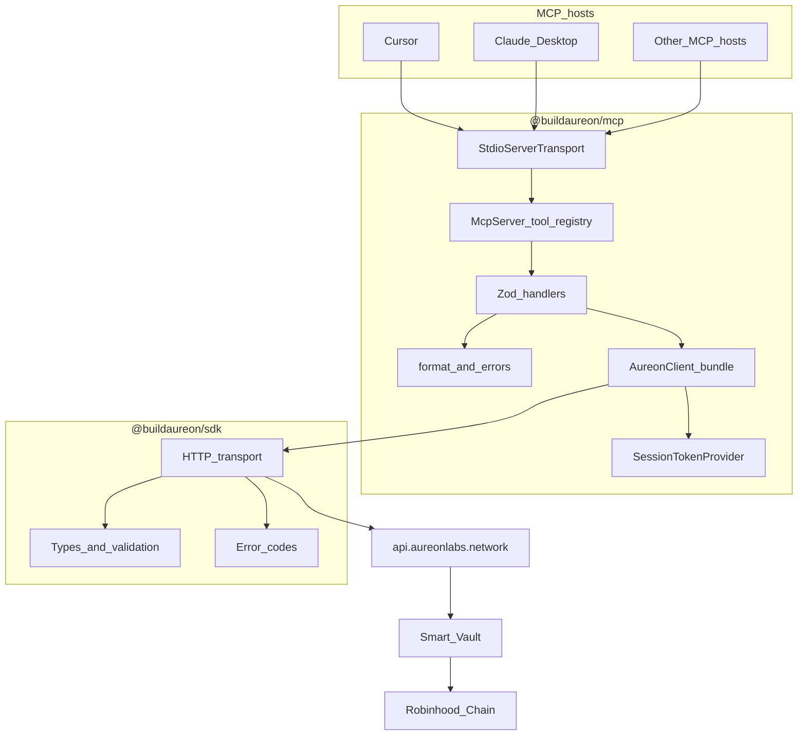
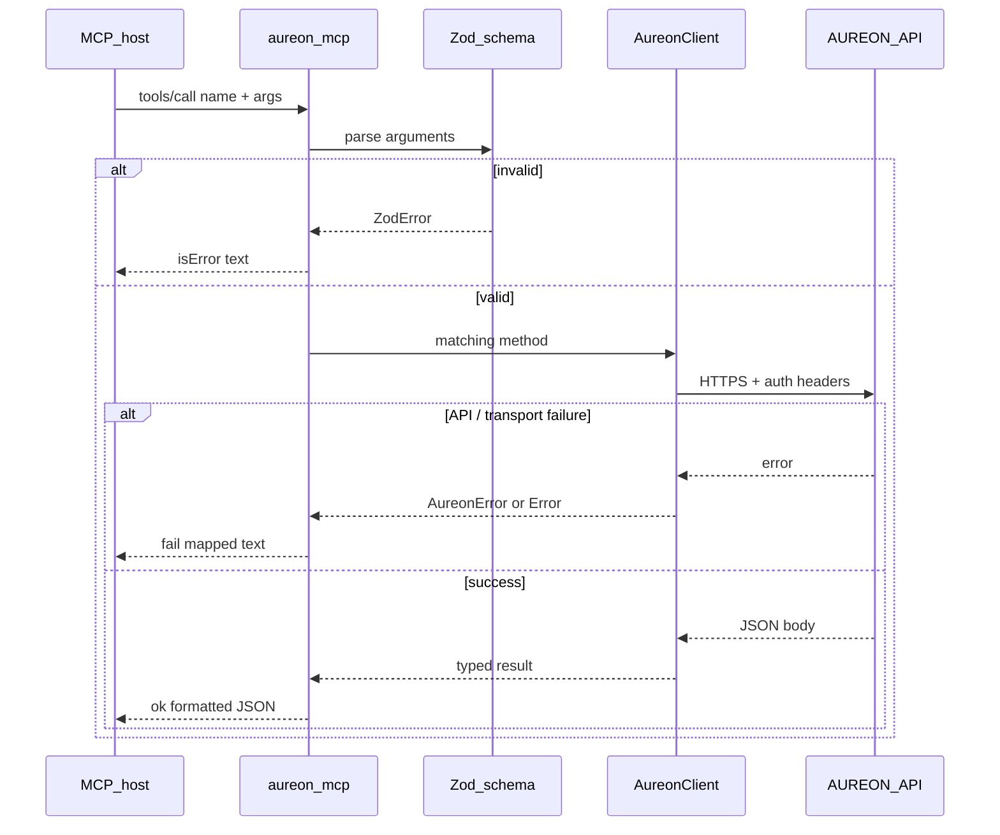

# Architecture

How `@buildaureon/mcp` sits on top of `@buildaureon/sdk` and the hosted AUREON API.

This document is for humans integrating the package and for AI agents that need a stable mental model of layers, ownership, and request flow. It describes the published adapter only: a thin stdio MCP server that forwards tool calls to the SDK, which talks to `https://api.aureonlabs.network`.

---

## 1. Overview

**AUREON** exposes Financial Compass control-plane APIs (objectives, portfolio book, health, restore plans, vault prepare helpers, developer keys). Agents do not need to invent HTTP paths or auth headers when they can call named MCP tools instead.

**`@buildaureon/mcp`** is that named surface. It:

- Speaks Model Context Protocol over **stdio** to a host (Cursor, Claude Desktop, or any MCP-compatible runner).
- Validates tool arguments with **Zod** schemas at the handler boundary.
- Delegates every successful call to **`@buildaureon/sdk`** (`AureonClient`).
- Formats JSON results and maps SDK errors into short, agent-readable text.

It does **not** embed policy math, vault encoding, keeper logic, or chain broadcasting. Those live in the API, the chain contracts, and the operator’s own signing path.

### Layer stack

```
Host (Cursor / Claude / other MCP host)
  → MCP JSON-RPC over stdio
    → mcp handlers + Zod
      → @buildaureon/sdk HTTP client
        → https://api.aureonlabs.network
          → vault / Robinhood Chain settlement path
```

### System context (mermaid)



The MCP binary is a **local adapter**. Hosts spawn it as a child process; it is not intended as a public HTTP gateway.

---

## 2. Responsibility table

| Concern | Owner | Notes |
| --- | --- | --- |
| Tool names and descriptions | MCP | One tool per public SDK method |
| Zod argument schemas | MCP | Reject bad shapes before network I/O |
| Pretty-print JSON for agents | MCP (`format.ts`) | Stable indentation / truncation hygiene |
| Map SDK errors → text | MCP (`errors.ts`) | Prefer `[CODE] message` form |
| Env config (`AUREON_*`) | MCP (`config.ts`) | Startup validation |
| stdio / MCP JSON-RPC | `@modelcontextprotocol/sdk` | Transport + server primitives |
| HTTPS client, retries, timeouts | SDK | Shared with non-MCP apps |
| Request/response types | SDK | Canonical TypeScript contracts |
| Input normalization | SDK | Amounts, ids, enums |
| Error codes (`UNAUTHORIZED`, …) | SDK | Cross-client consistency |
| Session token holder | SDK provider + MCP auth tools | Mutable Bearer in-process |
| Policy engine / restore planning | Hosted API | Not reimplemented in MCP |
| Vault calldata encoding | Hosted API | Prepare endpoints return unsigned steps |
| On-chain broadcast / signing | Operator / host wallet | Outside MCP process |
| Key pause / revoke | API + developer tools | Control-plane lifecycle |

Rule of thumb: if a change affects every AUREON client (CLI scripts, bots, MCP), put it in the **SDK or API**. If it only helps agents discover or call the surface, put it in **MCP**.

---

## 3. Request lifecycle

### Process start

1. Host launches `aureon-mcp` (or `npx -y @buildaureon/mcp`) with environment variables.
2. `src/index.ts` calls `startServer()` from `server.ts`.
3. `loadConfig()` reads `AUREON_API_URL` (default production API), `AUREON_API_KEY`, and optional `AUREON_AUTH_TOKEN`.
4. Startup requires at least one credential: issued API key and/or initial Bearer.
5. `createClient()` builds a `SessionTokenProvider` and an `AureonClient` bound to that provider.
6. `registerTools()` attaches the full tool catalog to an `McpServer` instance.
7. `StdioServerTransport` connects; the process blocks on stdin/stdout until the host exits.

### Per tool call



Typical agent loop (restore):

1. `aureon_get_health` — detect violation / drift.
2. `aureon_get_restore_plan` — inspect proposed steps and settlement mode.
3. `aureon_restore_objective` — execute plan; read `settlement: "vault" | "staged"`.
4. Optionally `aureon_list_executions` / timeline tools for receipts.

Issued API keys travel as `X-Aureon-Api-Key`. Optional wallet Bearer uses `Authorization`. Neither is printed into tool results.

---

## 4. Tool registration

Registration is centralized and domain-split:

| Module | Role |
| --- | --- |
| `tools/catalog.ts` | Canonical ordered list of tool names / count |
| `tools/index.ts` | Calls each domain `register*` helper |
| `tools/handler.ts` | Shared `ok` / `fail` wrappers |
| `tools/read.ts` | Overview, portfolio read, health, timeline, … |
| `tools/compass.ts` | Restore plan, restore, executions |
| `tools/vault.ts` | Vault status + prepare deposit/withdraw |
| `tools/auth.ts` | Nonce, verify, login, logout, me |
| `tools/objectives.ts` | Create / update / pause / resume |
| `tools/portfolio.ts` | Set / clear / sync Capital Book |
| `tools/market.ts` | Presets, shocks, watchdog |
| `tools/developer.ts` | List / create / revoke / toggle API keys |

Design constraints:

1. **One tool per SDK method** — predictable for agents and docs.
2. **Names are stable** — `aureon_*` prefix; catalog is the source of truth for count.
3. **Handlers stay thin** — parse → call → format; no second business layer.
4. **Write tools are explicit** — agents must choose create/restore/prepare; nothing auto-trades.

When adding a new SDK method, the MCP checklist is: catalog entry, Zod schema, register helper, docs row in `tools.md`, and a short example in the agent guide if the workflow is non-obvious.

---

## 5. Session provider

`client.ts` wires:

```text
createSessionTokenProvider(initialToken?)
createAureonClient({ baseUrl, apiKey, getAccessToken })
```

Behavior:

- **Issued API key** is fixed for the process lifetime (from env). It authenticates the control plane without a wallet handshake.
- **Bearer token** is mutable. Auth tools (`aureon_verify_wallet`, `aureon_dev_login`) call `session.setToken(...)`. `aureon_logout` clears it.
- `getAccessToken` is consulted per SDK request so mid-session verify/login takes effect without restarting the host.
- MCP never persists tokens to disk. Memory only, for the child process lifetime.

Recommended production posture: rely on an issued key for agent hosts; use wallet Bearer only when a human-driven verify flow is intentional.

---

## 6. Error mapping

`errors.ts` converts failures into compact strings:

| Input | Output shape |
| --- | --- |
| SDK `AureonError` | `[CODE] message` |
| Generic `Error` | `message` |
| Unknown throw | `String(err)` |

Handlers mark tool responses with `isError: true` so hosts surface failures distinctly from JSON payloads.

Agents should:

- Treat `[UNAUTHORIZED]` / `[FORBIDDEN]` as credential or key-state problems (paused/revoked key, missing Bearer).
- Treat `[VALIDATION]` as bad arguments — fix inputs, do not retry blindly.
- Treat transport timeouts as transient; retry read tools carefully, avoid duplicate write tools without idempotency checks.

MCP does not invent new error codes. Codes originate in the SDK / API so scripts and agents share vocabulary.

---

## 7. What lives in SDK vs MCP

### Lives in `@buildaureon/sdk`

- HTTP transport to `https://api.aureonlabs.network` (or configured base URL).
- Header composition (API key + Bearer).
- Retries, timeouts, and typed client methods.
- Shared types for objectives, health, restore plans, vault prepare results.
- Session token provider factory.
- Canonical error model (`isAureonError`, codes).

### Lives in `@buildaureon/mcp`

- Process entry (`index.ts`) and stdio server bootstrap (`server.ts`).
- Env loading / startup gates (`config.ts`).
- Client bundle assembly for MCP (`client.ts`).
- Tool catalog, Zod schemas, domain registration modules.
- Agent-facing formatting (`format.ts`) and error text (`errors.ts`).
- Examples of host MCP JSON configs (Cursor / Claude Desktop).

### Lives outside both packages

- Private keys and hardware wallets.
- Transaction broadcasting and gas payment.
- Human approval UX in the host product.
- Hosted policy engine, keepers, and vault contracts.

---

## 8. Conceptual file map

| Path | Responsibility |
| --- | --- |
| `src/index.ts` | CLI / bin entry — starts the server |
| `src/server.ts` | Config → client → register tools → stdio connect |
| `src/config.ts` | Parse and validate `AUREON_*` env |
| `src/client.ts` | `AureonClient` + `SessionTokenProvider` bundle |
| `src/errors.ts` | SDK / unknown → agent-readable text |
| `src/format.ts` | JSON formatting for tool results |
| `src/tools/catalog.ts` | Ordered tool names and `TOOL_COUNT` |
| `src/tools/handler.ts` | Shared success / failure response helpers |
| `src/tools/index.ts` | Registers all domains onto `McpServer` |
| `src/tools/read.ts` | Read-mostly control-plane queries |
| `src/tools/compass.ts` | Restore plan and execution surface |
| `src/tools/vault.ts` | Vault reads + unsigned prepare helpers |
| `src/tools/auth.ts` | Auth handshake + session mutation |
| `src/tools/objectives.ts` | Objective lifecycle writes |
| `src/tools/portfolio.ts` | Capital Book mutations / sync |
| `src/tools/market.ts` | Market presets, events, watchdog |
| `src/tools/developer.ts` | Issued API key management |

Supporting package docs (`setup`, `auth`, `tools`, `agent-guide`, `security`) describe usage; this file describes structure.

---

## 9. Versioning

| Artifact | Version meaning |
| --- | --- |
| `@buildaureon/mcp` package version | Adapter release (tool catalog, schemas, formatting) |
| MCP server `version` field | Mirrors package version reported to hosts |
| `@buildaureon/sdk` dependency | Protocol / client contract with the API |
| API at `api.aureonlabs.network` | Server-side behavior; may evolve independently |

Compatibility expectations:

- **Patch** MCP releases: formatting, docs, defensive validation — no tool renames.
- **Minor** MCP releases: new tools mirroring new SDK methods; existing names stay.
- **Major** MCP releases: breaking tool renames or required auth model changes (rare; documented in release notes).

Agents should pin a known MCP package version in host config when reproducibility matters. Prefer matching SDK majors that the MCP release was tested against.

---

## 10. Design principles

1. **Thin adapter** — do not reimplement SDK validation or policy in MCP.
2. **One tool per SDK method** — keep discovery and docs mechanical.
3. **Honest settlement** — pass through `settlement` fields; never claim on-chain when staged.
4. **Non-custodial** — prepare tools stop at unsigned calldata.
5. **Local stdio** — not a multi-tenant public MCP HTTP service.
6. **Secrets stay out of logs** — formatters must not dump env or Authorization headers.
7. **Least surprise** — tool names and JSON shapes should match SDK method names closely enough that humans can map them without a glossary.

---

## 11. Host ownership and vault prepare

Hosts declare the command (`npx` / `aureon-mcp`) plus env (`AUREON_API_KEY`, optional Bearer / API URL). The host owns which chats may invoke tools and how humans approve on-chain steps. MCP owns only the child process that answers tool calls.

Vault prepare is intentionally incomplete from a settlement perspective:

1. Agent calls `aureon_prepare_vault_deposit` or `aureon_prepare_vault_withdraw`.
2. MCP → SDK → API returns unsigned steps / calldata descriptions.
3. A human or external signer reviews and broadcasts.
4. Later reads (`aureon_get_vault`, status tools) reflect chain state once confirmed.

MCP never submits signed transactions. That boundary is load-bearing for the security model (see `security.md`).

---

## 12. FAQ

**Is MCP a second API?**  
No. It is a stdio adapter over the same SDK client used by scripts.

**Can I run MCP without an issued API key?**  
Only if a valid Bearer is supplied (env or verify/login tools). Issued keys are the recommended agent path.

**Where does business logic run?**  
On the hosted API and chain. MCP formats and forwards.

**Why Zod if the SDK already validates?**  
Early rejection at the tool boundary improves agent feedback. SDK validation remains authoritative for deeper rules.

**Does MCP cache portfolio or health?**  
No long-lived cache. Each tool call hits the SDK/API (subject to normal HTTP behavior).

**What happens if the host restarts?**  
The MCP child restarts; in-memory Bearer is lost. Issued key from env is reloaded.

**How many tools are there?**  
See `tools/catalog.ts` (`TOOL_COUNT`) and `tools.md`.

**Can I expose MCP over the public internet?**  
Do not. The trust model assumes a local host-spawned stdio process.

**Where should I put custom agent workflows?**  
In prompts, host rules, or orchestration — not by forking business logic into MCP handlers.

**How does this relate to the operator utility?**  
The utility remains a separate wallet-Bearer UI. MCP does not replace it.

---

## 13. Related documents

- [Setup](./setup.md) — install and host configuration patterns
- [Authentication](./auth.md) — API keys, Bearer handshake, session tools
- [Tools](./tools.md) — full tool catalog
- [Agent guide](./agent-guide.md) — recommended call sequences
- [Security](./security.md) — threat model and operational hygiene

---

## 14. Summary

`@buildaureon/mcp` is a **thin stdio adapter**: Host → MCP handlers/Zod → `@buildaureon/sdk` → `https://api.aureonlabs.network` → vault/chain. Responsibilities are split so agents get a stable tool surface while all financial intelligence and custody boundaries remain outside the MCP process.
