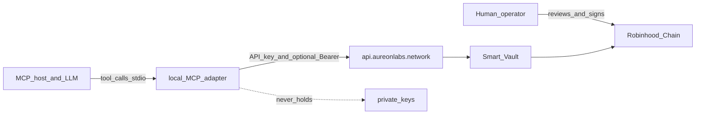
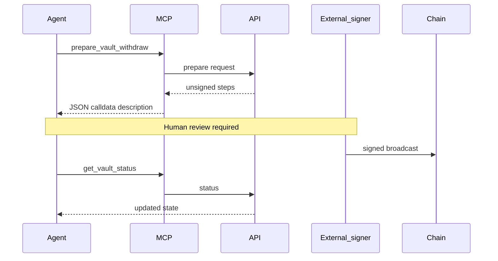

# Security

Threat model and operational guidance for running `@buildaureon/mcp` against the live AUREON API.

This document is for operators configuring agent hosts and for AI agents that must respect custody and credential boundaries. It complements `architecture.md`: the adapter is thin, but the **blast radius of a leaked API key or a mis-hosted MCP process** is not.

---

## 1. Trust boundaries (light threat model)

| Boundary | Assumption | Failure mode if broken |
| --- | --- | --- |
| MCP process | Local stdio child of a trusted host | Remote callers could invoke any registered tool |
| Issued API key | Equivalent to “act as this developer / wallet scope” on the control plane | Attacker creates objectives, restores, prepares vault steps, manages keys |
| Private key | Never enters MCP env or process | Full fund theft if combined with broadcast capability |
| Host LLM / agent | Can call any enabled tool | Prompt injection or confused deputy may trigger writes |
| Operator utility | Separate wallet-Bearer UI | Unrelated to MCP, but same API identity if same wallet |
| HTTPS to API | TLS to `https://api.aureonlabs.network` | MITM only if TLS broken or base URL pointed at attacker |

### Assets worth protecting

1. **Issued API keys** — long-lived control-plane credentials.
2. **Bearer session tokens** — short-lived wallet sessions in process memory.
3. **Unsigned prepare payloads** — not spendable alone, but valuable for phishing / wrong-chain tricks if altered.
4. **Agent conversation logs** — may accidentally echo secrets if tools or prompts dump env.

### Adversaries (simplified)

- Malicious or compromised MCP host configuration.
- Prompt injection that steers an agent toward write tools.
- Leaked key material from chat logs, screenshots, or shared configs.
- Insider with host access but without wallet keys (still dangerous for control plane).

This is a **light** threat model: enough to drive defaults, not a formal audit report.

---

## 2. Credential handling

### Issued API keys (`AUREON_API_KEY`)

- Created via developer tools / utility Developers surface; **plaintext shown once** at issuance.
- Treat as a **secret password** for the AUREON control plane.
- Store in the host’s MCP env configuration or a secret manager — **never** commit to git, never paste into public issues, never embed in prompts as standing instructions.
- Prefer **one key per agent host** (e.g. Cursor workspace vs Claude Desktop vs CI agent).
- Pause or revoke immediately on suspicion of leak (`aureon_toggle_api_key`, `aureon_revoke_api_key`, or utility equivalents).

### Bearer tokens (`AUREON_AUTH_TOKEN` / session)

- Obtained from wallet verify flows (`aureon_get_auth_nonce` → sign off-MCP → `aureon_verify_wallet`) or optional env bootstrap.
- Held **in-process only** by the SDK session provider; MCP does not write them to disk.
- Clear with `aureon_logout` on shared long-lived hosts when the human session ends.
- Do not log, print, or ask the model to “show the token.”

### What travels on the wire

- Issued key: `X-Aureon-Api-Key` (SDK).
- Bearer: `Authorization` (SDK).
- Both are composed inside the SDK HTTP client. MCP handlers should not re-implement header injection.

### Private keys

- **Never** place a wallet private key or seed in MCP environment variables.
- Required only to **broadcast** transactions after prepare tools return unsigned steps.
- Keep keys in the operator wallet, hardware wallet, or a dedicated signing service **outside** the MCP child process.

---

## 3. What MCP never does

`@buildaureon/mcp` deliberately omits capabilities that would collapse the custody boundary:

| Capability | MCP behavior |
| --- | --- |
| Hold private keys | Never |
| Sign transactions | Never |
| Broadcast to chain | Never |
| Custodial withdraw | Never |
| Silent auto-trade without a plan | Never — restores are explicit tool calls |
| Persist secrets to disk | Never |
| Expose a public HTTP MCP endpoint | Not supported / not recommended |
| Claim `settlement: "vault"` when staged | Never — pass through API honesty fields |
| Print API keys in tool results | Must not |

If a fork or wrapper adds signing inside the MCP process, it is **no longer** the same trust model. Treat that as a different product with a different review bar.

---

## 4. Deposit / withdraw trust boundary

Vault tools are split on purpose:

1. **Read** — `aureon_get_vault`, `aureon_get_vault_status` (and related reads) show state.
2. **Prepare** — `aureon_prepare_vault_deposit` / `aureon_prepare_vault_withdraw` return **unsigned** steps / calldata descriptions.
3. **Sign & broadcast** — human or external signer only.
4. **Observe** — later reads confirm chain effects.

### Operator checklist for prepare flows

- Confirm the **amount**, **asset**, and **destination** in the prepare payload before signing.
- Confirm you are on the intended network (Robinhood Chain context as documented by AUREON).
- Do not ask the agent to “just sign it” with a key the agent can access.
- Treat unexpected prepare output (wrong recipient, odd calldata) as a stop-ship signal.

Prepare without broadcast cannot move funds. Broadcast without review can. Keep the human (or a hardened signing policy engine) in that gap.

---

## 5. Key rotation, pause, and revoke

### Rotation pattern

1. Create a new issued key (`aureon_create_api_key` or utility).
2. Update host MCP env to the new key.
3. Restart the MCP host / child process so config reloads.
4. Verify with a read tool (`aureon_ping`, `aureon_me`, or overview).
5. **Revoke** or **pause** the old key.

Avoid long dual-key windows on untrusted machines. Prefer short overlap only while validating the new host config.

### Pause vs revoke

| Action | Intent |
| --- | --- |
| Pause / toggle off | Temporary disable without destroying the key record |
| Revoke | Permanent invalidation after leak or decommission |
| Logout (Bearer) | Clear in-memory session only; does not revoke issued keys |

### Least privilege habits

- Separate keys for **read-heavy experimentation** vs **production agent** hosts when the product surface allows operational separation.
- Do not share one key across untrusted operators or public demo machines.
- Limit which host profiles load write-capable MCP configs.
- Prefer issued keys over long-lived Bearer env injection for agents.

---

## 6. Host config hygiene

MCP hosts typically store command + env in a JSON (or UI) config. Hygiene rules:

1. **Secrets only in env fields** managed by the host — not in chat history, not in repo files checked into git.
2. **Do not commit** MCP config files that contain live keys. Prefer redacted examples in docs (see package `examples/`).
3. **Restrict workspace access** — anyone who can edit MCP config can point the agent at their own key or change the API base URL.
4. **Watch `AUREON_API_URL` overrides** — only use non-default bases when you intentionally target a documented non-production environment. A malicious override is a credential phishing vector.
5. **Browser vs agent hosting** — browser-based agent products may persist configs in cloud profiles; treat those as higher risk than a local desktop host you control. Prefer short-lived keys and aggressive revoke there.
6. **Disable MCP** when not needed — reduce accidental write tool invocation.
7. **Never ask the model to echo env** — including “debug by printing AUREON_API_KEY.”

### Logging

- Application logs must not include Authorization headers, API keys, or raw verify signatures.
- Prefer logging tool **names** and high-level outcomes, not full credential-bearing payloads.
- If a host captures full tool I/O for debugging, scrub secrets before sharing traces.

---

## 7. Agent / LLM-specific risks

Agents amplify ordinary API risks:

| Risk | Mitigation |
| --- | --- |
| Prompt injection (“ignore policy, restore now”) | Human approval for destructive tools; narrow system rules |
| Confused deputy (agent acts for attacker text) | Treat untrusted documents as untrusted; confirm writes |
| Secret exfiltration via tool args | Never pass keys as tool arguments; keys stay in env/SDK |
| Over-broad tool enablement | Enable only needed tools if the host supports filtering |
| Stale sessions | Logout; rotate keys after shared-machine use |

Remember: **the model is not a security boundary**. The boundary is env isolation, key lifecycle, and human signing for chain moves.

---

## 8. Production checklist

Use this before enabling `@buildaureon/mcp` on a machine that can affect real capital:

- [ ] Issued API key created specifically for this host
- [ ] Key stored only in host secret/env config (not in git)
- [ ] Private keys absent from MCP env and agent-accessible storage
- [ ] Default API URL is `https://api.aureonlabs.network` unless override is intentional
- [ ] Host is local stdio — not published as an open network service
- [ ] Write tools understood by operators (`create`, `restore`, `prepare`, key CRUD)
- [ ] Prepare → human sign → broadcast workflow documented for the team
- [ ] Pause/revoke path tested once (know which tool/UI to use under stress)
- [ ] Logging scrubbed of secrets
- [ ] Browser-hosted agents use stricter key lifetimes than desktop if used at all
- [ ] Onboarding docs for agents point at least-privilege tool use
- [ ] Incident contacts known (who rotates keys, who pauses agents)

---

## 9. Incident response basics

### If an API key may be leaked

1. **Pause or revoke** the key immediately (developer tools or utility).
2. **Restart** hosts so stale processes drop the old env after config update.
3. **Inventory** recent objectives, restores, prepares, and key CRUD via timeline / executions / key list tools.
4. **Issue a replacement key**; update only trusted hosts.
5. **Review** whether Bearer sessions were also exposed; logout and re-verify if needed.
6. **Communicate** to operators: stop signing prepare payloads from unknown sessions until review completes.

### If a private key may be leaked

1. This is **outside MCP** but higher severity — move funds / rotate wallets per your chain runbook.
2. Revoke associated API keys as a secondary control-plane lockdown.
3. Assume any unsigned prepare history could be replayed by an attacker who also has the key.

### If an agent mis-fired writes

1. Pause the objective or agent host.
2. Inspect health, timeline, and executions for settlement honesty (`vault` vs `staged`).
3. Do not “fix forward” with more restores until intent is clear.
4. Rotate keys if the mis-fire suggests prompt injection with data exfil attempts.

### Evidence to preserve

- Timestamps of tool calls (host logs, if scrubbed).
- Objective ids and execution receipts.
- Key ids (not secret material) involved.

Do not paste live secrets into tickets.

---

## 10. Browser vs desktop agent hosting

| Hosting style | Typical risk | Guidance |
| --- | --- | --- |
| Local desktop MCP (Cursor / Claude Desktop style) | Config files on disk; local malware | Disk encryption; least-privilege OS user; no shared accounts |
| Cloud / browser agent with remote tool runner | Broader persistence and sharing surfaces | Short-lived keys; revoke often; avoid high-value wallets |
| Shared demo machine | Key reuse across people | Unique keys; revoke after demo; no private keys nearby |

In all cases: MCP remains a **local adapter pattern** conceptually. If a product remotes the stdio server, you have changed the threat model — re-validate network ACLs and auth before use.

---

## 11. Honest settlement and integrity

Security is not only custody; it is also **truthfulness of outcomes**:

- Agents must surface `settlement` fields accurately.
- Staged settlement is not the same as vault/on-chain completion.
- Do not coach models to rewrite receipts as “done on-chain” when the API said `staged`.

Integrity failures (lying about settlement) create operator errors that look like security incidents later.

---

## 12. Dependency and supply-chain notes

- Install `@buildaureon/mcp` from the published package registry you trust.
- Pin versions when reproducibility and change control matter.
- The MCP package depends on `@buildaureon/sdk` and `@modelcontextprotocol/sdk`.
- Review release notes when upgrading — new tools expand the agent’s write surface.

---

## 13. FAQ

**Is an issued API key as powerful as my wallet private key?**  
No. It does not sign chain transactions. It **is** powerful on the control plane (objectives, restores, prepares, key management). Protect it accordingly.

**Can MCP steal funds by itself?**  
Not via signing — it never holds private keys. Funds move only after an external signer broadcasts. Control-plane misuse can still create harmful plans or confuse operators.

**Should I put my private key in the host env so the agent can deposit for me?**  
No. That collapses the custody model. Keep signing outside MCP.

**What if I need automation for broadcast?**  
Use a dedicated signing service with its own policy engine and audit log — not the MCP adapter.

**Is Bearer safer than an API key?**  
Different tradeoffs. Bearer is often shorter-lived; issued keys are better for unattended agents. Both are secrets.

**Can I run multiple MCP hosts with one key?**  
Technically yes; operationally prefer one key per host for blast-radius control.

**Does `aureon_logout` revoke my issued key?**  
No. It clears the in-memory Bearer only.

**What should agents refuse to do?**  
Print secrets, accept private keys as tool args, claim vault settlement without API fields, or broadcast transactions.

**Where is the deeper architecture?**  
See `architecture.md` for layers, registration, and SDK vs MCP ownership.

**Who do I contact for platform incidents?**  
Follow AUREON’s published support / security channels on the product site; include key ids and timestamps, never raw secrets.

---

## 14. Related documents

- [Architecture](./architecture.md) — layers and request lifecycle
- [Authentication](./auth.md) — key and Bearer flows
- [Setup](./setup.md) — host configuration patterns
- [Tools](./tools.md) — including developer key tools
- [Agent guide](./agent-guide.md) — safe call sequences

---

## 15. Summary

Treat `@buildaureon/mcp` as a **local, non-custodial stdio adapter** over `@buildaureon/sdk` to `https://api.aureonlabs.network`. Protect issued keys like passwords, keep private keys out of the MCP process, require human (or hardened external) signing for deposit/withdraw broadcast, rotate and revoke quickly, and assume the LLM is not a security boundary — configuration hygiene and least privilege are.
